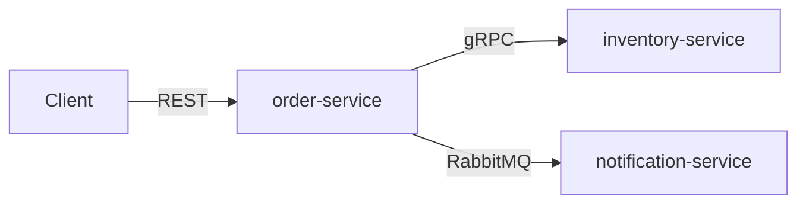
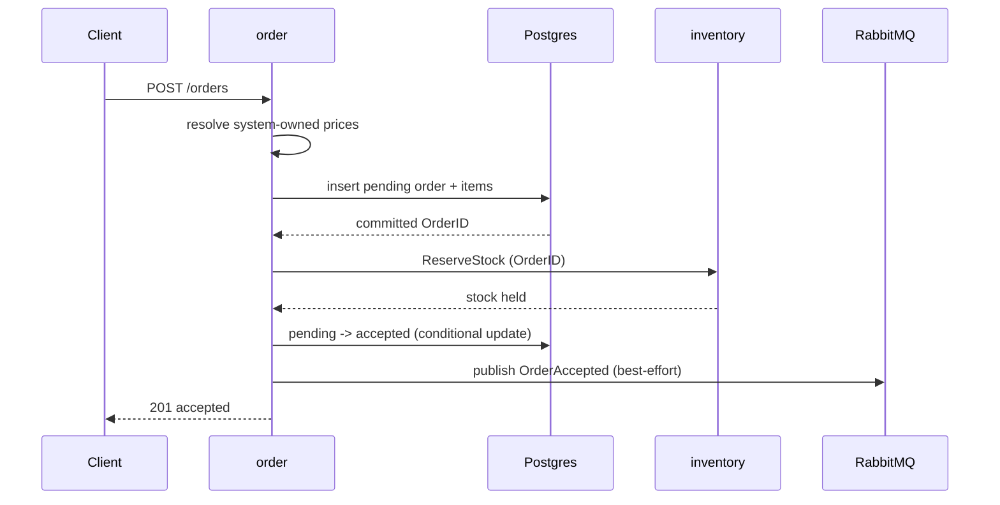
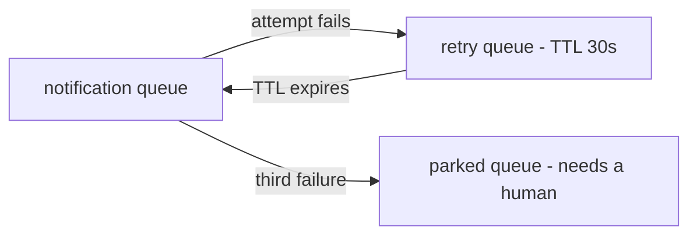

# Architecture

This document explains how the system is put together and, more importantly, **why**.
Decisions are recorded here as they are made, so everything is in one place.

- [The system](#the-system)
- [Why these three services](#why-these-three-services)
- [Why one repository](#why-one-repository)
- [How services share contracts](#how-services-share-contracts)
- [Inside a service: staying testable](#inside-a-service-staying-testable)
- [What happens when things fail halfway](#what-happens-when-things-fail-halfway)
- [How inventory survives contention](#how-inventory-survives-contention)
- [What CI enforces](#what-ci-enforces)
- [Trade-offs accepted](#trade-offs-accepted)

---

## The system

The intended showcase is an order processing system with three service boundaries:



| Service | Responsibility | Exposes |
| --- | --- | --- |
| **order** | Accepts and manages orders | REST API, RabbitMQ events |
| **inventory** | Tracks and reserves stock | gRPC API |
| **notification** | Sends notifications | consumes events |

Each hop uses a different style on purpose. Placing an order needs an immediate
answer from inventory, so that call is synchronous. Sending a notification does not
need to block the order, and should not fail the order if the notifier is down, so
that hop is asynchronous.

All three services are now real, and both hops are: `order-service` exposes
`POST /orders`, calls `inventory-service` over gRPC, and publishes `OrderAccepted` to
RabbitMQ, where `notification-service` consumes it.

What remains deliberately unfinished is the product catalog, which is still a temporary
in-process adapter, and the **transactional outbox**. Without the outbox, publication is
not atomic with the database commit that causes it, so the asynchronous hop is
best-effort rather than guaranteed — see [what publishing the event actually
guarantees](#what-publishing-the-event-actually-guarantees), which is the honest bound
on everything below.

---

## Why these three services

The split follows one rule: **things that change for different reasons, and break in
different ways, live apart.**

| Service | The rule it protects | Why it is on its own |
| --- | --- | --- |
| **order** | An order cannot be accepted without reserved stock, and cannot be cancelled once shipped | Owns the order lifecycle. Changes when order rules change. |
| **inventory** | Available stock never drops below zero | Its hard problem is contention — many orders competing for the same rows at once. A completely different concurrency profile from order. |
| **notification** | none | It has no business rule at all. It is separate because it *fails* differently: email providers are slow and unreliable, and that must never stop someone placing an order. |

The clearest sign that these are real boundaries is the word "order" itself. In
order-service it is a lifecycle with states and rules. In inventory it is just an ID
attached to a reservation. In notification it is a few fields in an email template.
One word, three meanings — that is where a boundary belongs.

**Being honest about it.** At this volume, a single service with three packages would
work fine and would be less work to run. The split is here to demonstrate service
boundaries. What makes it defensible rather than decorative is that the lines follow
the rules above — each service could be scaled, deployed, and rewritten on its own.

**What would tell me the boundary is wrong.** If order and inventory always changed in
the same pull request and always deployed together, they would be one service
pretending to be two.

---

## Why one repository

All three services live in a single repository.

**It is a showcase.** A reader opens one repository and sees the whole system — how
the services are split, how they talk, and how the pieces fit.

**When I would decide differently.** Separate repositories pay off when separate teams
need to release on their own schedule — several teams owning services independently,
services written in different languages, or genuinely different release cadences. Then
separate repositories, and a schema registry such as Buf's BSR, start to pay for
themselves. None of that holds here: for around five backend developers, ten
repositories for ten services means ten CI pipelines, ten sets of dependency updates,
and ten places to change when something shared moves. Real cost, no benefit.

---

## How services share contracts

order-service calls inventory over gRPC and publishes events to notification over
RabbitMQ. Both need a shared definition of the messages, and both now have one: a
protobuf contract in a Go module owned by the service whose API it is.

Both are in use: order-service calls `inventory.v1.ReserveStock` and publishes
`order.v1.OrderAccepted`, which notification-service consumes. Everything below about
ownership, generation and compatibility applies to both, but they are owned by opposite
ends of their respective hops — see [who owns a message](#who-owns-a-message).

### Options not taken

**One shared `contracts/` package holding everything.** Easy at the start. But nobody
owns it, so over time everything gets dropped in it. And a service no longer owns the
API it serves — the definition of the inventory API would sit outside inventory.

**Copy the contract into every service that needs it.** Each service keeps its own copy
of the `.proto` file. This works on day one and needs no shared code at all. But there
is no longer a single source of truth, so the copies drift — and nothing tells you.

### Contract ownership

Each service keeps its public API in a small, separate Go module inside its own folder:

```
inventory-service/
  go.mod                    ← the service itself (database, gRPC server, ...)
  api/
    go.mod                  ← the public API, and nothing else
    buf.yaml                ← its own workspace, lint and breaking rules
    buf.gen.yaml            ← how it generates, pinned plugin versions
    proto/inventory/v1/
      service.proto         gRPC methods and message shapes
    gen/inventory/v1/       generated Go code (committed to git)

order-service/
  go.mod                    ← the service itself (HTTP server, database, ...)
  api/
    go.mod                  ← protobuf, and nothing else
    buf.yaml
    buf.gen.yaml
    proto/order/v1/
      order_accepted.proto  the event shape, one file per event
    gen/order/v1/           generated Go code (committed to git)
    orderevents/
      topic.go              exchange, routing key, content type
```

Each is a Go module of its own with a deliberately tiny dependency list:
`inventory-service/api` needs two libraries, gRPC and protobuf; `order-service/api`
needs one, protobuf, because an event has no client stub to generate. That is checkable
rather than aspirational — open either `go.mod`.

A consumer writes:

```go
import inventoryv1 ".../inventory-service/api/gen/inventory/v1"   // client + message types
import orderv1 ".../order-service/api/gen/order/v1"               // event types
import ".../order-service/api/orderevents"                        // where to find them
```

and gets the types and nothing else.

**How the modules find each other.** `replace` directives in `order-service/go.mod` point
at `../inventory-service/api` and at its own `./api`. There is deliberately no `go.work`:
a workspace would need every one of its `use` directories present at build time, but each
service's Dockerfile copies only the directories it needs, so the workspace would have to
be rewritten during the image build. A `replace` behaves identically on a laptop and
inside Docker, and one mechanism is easier to reason about than two that can disagree.

**buf owns the generation.** The templates pin remote plugin versions, so `make proto`
produces byte-identical output on any machine without anyone installing `protoc-gen-go`.

There is one template per contract module rather than one for the workspace, and that is
a constraint rather than a preference. `paths=source_relative` strips a module's root from
the output path, so two modules generating in a single run would write into the same
directory and collide. `make proto` therefore runs buf once per module.

**Each contract module is its own buf workspace**, carrying both its `buf.yaml` and its
`buf.gen.yaml`. There are no buf files at the repository root at all.

That is worth more than tidiness, because it is enforcement. A single workspace listing
both modules lets one service's `.proto` import another's, and buf resolves it without
complaint — after which a change to inventory's contract can break order's generated code,
which is precisely the coupling separate modules exist to prevent. With a workspace per
service the same import fails to resolve. The boundary stops being a convention somebody
has to remember and becomes something the toolchain refuses.

It also makes each service self-contained: extracting one to its own repository is a
directory copy, with no configuration stranded in somebody else's root, and no root file
listing services that a future service without a contract would have to be excluded from.

The cost is that `make proto`, `proto-lint` and `proto-breaking` loop over modules instead
of running once — which is what the Go targets already do, discovered the same way, so a
service added later is covered without editing anything, and a service with no protobuf
contract is skipped by having no `buf.yaml`. Policy is duplicated between the two modules
rather than shared, which is the honest trade: each contract can choose its own lint and
breaking rules without negotiating.

It also deletes each generated directory first. Without that, deleting a `.proto` leaves
its `.pb.go` behind indefinitely: still compiling, still importable, no longer backed by
a contract.

`make proto-lint` enforces the standard naming rules, and `make proto-breaking` compares
against `main` — the part that turns "we have a `.proto`" into an actual contract.

### Who owns a message

"The service owns its API" answers where `ReserveStock` lives, because there is one server
and it is obvious which one. It does not answer where an event lives, and the gRPC habit
pulls the wrong way: for a request the *server* owns the contract, so it is tempting to
conclude the consumer owns a message too.

The rule is **events are owned by their producer, commands by their receiver.** The two are
opposite because they are different kinds of message, and the distinction is worth being
precise about:

| | Event | Command |
| --- | --- | --- |
| Says | "this happened" | "do this" |
| Consumers | any number, unknown to the producer | exactly one, named by the sender |
| Owner | the producer — it is the authority on the fact | the receiver — the capability is its API |
| Here | `order.v1.OrderAccepted` | `inventory.v1.ReserveStock` |

`OrderAccepted` belongs to order-service because order-service is the authority on the fact
that an order changed state. Notification is one possible subscriber; analytics, fulfilment
or fraud detection could subscribe later. That is also the argument that settles it —
consumer ownership has no answer to "which of the five owns the schema?", while producer
ownership gives the same answer at one consumer and at fifty.

The mirror image was a real option. A notification *platform* — owning templates, channels
and delivery preferences — would expose `SendNotification(template_id, recipient, params)`,
and would own that contract exactly as inventory owns `ReserveStock`. It was rejected here
because it inverts the dependency: order-service would hold a template id and know what
belongs in an email, which is the coupling the notification boundary exists to avoid. An
event keeps order-service unaware that notification exists at all.

**Declaring is not owning.** Both the publisher and its consumers declare the `orders`
exchange, so that either can start first. The name, the shape and the meaning stay
order-service's.

So the concerns divide three ways, and none of the three is the broker's:

| Concern | Owner |
| --- | --- |
| Event meaning, name, schema, version, exchange and routing key | order-service |
| Queue names, bindings, concurrency, retries, dead-lettering, templates, provider, deduplication | notification-service |
| Broker provisioning, credentials, retention, monitoring | platform / operations |

Producer ownership is only half a decision, because on its own it lets one team break every
consumer. It is paid for by two obligations:

**The event is curated, not the aggregate on the wire.** Every field in `OrderAccepted`
exists because a subscriber named a use for it. `domain.Order` is where the values come
from, not what the message is — publishing the aggregate would make an internal refactor
into everyone else's breaking change. `CustomerID` is left out for exactly this reason:
nothing can currently name a use for it, and a field is cheap to add and impossible to
remove.

**Compatibility is enforced mechanically, not by memory.** `buf breaking` runs in CI.
Without it, "order owns this" means "order can break you and find out later".

### What this gives us

**The service owns its API.** The contract lives in the service's own folder, so one
line in `CODEOWNERS` makes that ownership real rather than a convention.

**One place for everything a service exposes.** Everything crossing a service's boundary
lives in its `api` module — gRPC methods, event shapes, and the broker names those events
are published under. If a service later adds a REST API or Kafka events, they go here too.
Anyone asking "what can I get from this service?" has exactly one place to look.

One module, not one package. Generated types are in `gen/`, and handwritten values such as
the exchange and routing keys are in `orderevents/`, because handwritten code does not
belong in a directory a tool rewrites — `make proto` deletes `gen/` on every run.

**RabbitMQ is treated as seriously as gRPC.** The module holds the message shape *and*
the exchange, routing key and content type. That matters because a broker offers no
equivalent of a compiler: a consumer bound to a routing key nobody publishes any more does
not fail, it receives nothing.

Note precisely what that does and does not buy, because it is easy to overstate. Importing
the routing key means nobody retypes the string at a call site. It does **not** mean a
rename is caught: `buf breaking` compares schemas and cannot see a changed Go string, and
renaming a constant's *value* breaks no compilation anywhere. That gap is closed by a test
that pins the literal values, so an accidental edit fails CI instead of quietly orphaning
every consumer. Changing a routing key is not an edit; it is a new key published alongside
the old one until consumers have moved.

**Services stay self-contained.** Nothing outside a service defines what that service
does, and there is no shared package that everyone has to edit.

**Versioning is simple.** Adding a field or a method is a commit, not a negotiation. A
genuinely breaking change gets a new folder — `inventory/v2` alongside `v1`. The server
answers both while consumers move across, then `v1` is deleted.

State the additive case precisely, though: adding a field is **binary-wire-safe**, which is
not the same as harmless. A consumer that meets an unknown field must ignore it, and for
events there is a second case with no request/response equivalent — messages already sitting
in a queue were encoded before the field existed, so anything added to a live version has to
behave correctly when absent. Changing what an existing field *means* is never additive; it
is a new version.

**Consumers stay light.** Depending on inventory's API costs two libraries and on order's
costs one, so a service can consume several APIs without its dependency list growing. A
consumer that only reads events off a queue does not acquire a gRPC runtime to do it.

---

## Inside a service: staying testable

order-service persists to Postgres, calls inventory over gRPC, and publishes to RabbitMQ, all
through replaceable adapters. If checking the rule *"an order cannot be accepted without
reserved stock"* requires three pieces of infrastructure to be running, the tests are slow and
flaky, and people stop running them.

The rules live in a package that does not know any of those exist. The application
layer declares the external capability it needs as a port:

```go
// internal/order/application
type InventoryReserver interface {
    Reserve(ctx context.Context, request ReservationRequest) error
}

type OrderEventPublisher interface {
    PublishOrderAccepted(ctx context.Context, event OrderAcceptedEvent) error
}
```

Both ports have now been through the exercise the design was for. Each was first satisfied by
an in-process stub and is now satisfied by a real remote adapter — a gRPC client and a RabbitMQ
publisher — with no change to the port, the use case, or a single test of either. Go makes this
cheap: interfaces are satisfied implicitly and declared where they are *used* rather than where
they are implemented, so dependencies point inward with no framework and no dependency-injection
container.

The publisher port is worth reading closely, because its name is load-bearing. It was
`OrderNotifier.NotifyOrderCreated`, which quietly undid the boundary it was supposed to protect:
a service that is not meant to know a notifier exists should not have one named in its
application layer. It also named the wrong moment — an order is *created* as `pending` long
before this happens. `PublishOrderAccepted` describes the fact rather than the audience, which
is what lets a second subscriber arrive without the port meaning something else.

It takes an `OrderAcceptedEvent` rather than a `*domain.Order` for the same reason: a published
event is a contract and an aggregate is not, and the snapshot fixes the event's identity and
timestamp once so a retry announces the same fact instead of a second one.

```
order-service/
  internal/
    order/
      domain/                rules — standard library only
      application/           use cases — orchestrates domain and ports
      adapter/
        inbound/httpgin/     REST handlers
        outbound/postgres/   order repository
        outbound/catalogstub/       temporary price catalog
        outbound/inventorygrpc/     reserves stock over gRPC
        outbound/ordereventamqp/    publishes OrderAccepted
      wiring/                builds the order context
    platform/                config, correlation, logger, database pool,
                             HTTP server, RabbitMQ publisher
    bootstrap/               builds the process
  cmd/order/main.go          turns an error into an exit code
```

This is ports and adapters — also called hexagonal, and close to what clean
architecture describes. The name matters less than the property it buys:

> `go test ./internal/order/domain/...` needs no Docker, no network, and no other
> service running.

That property is exercised by the current test suite and is suitable for a dedicated
import-boundary CI check later.

### Where everything is wired

Something has to know that `OrderRepository` means Postgres. That knowledge sits at the
outermost ring, in exactly two packages: `internal/order/wiring` builds the order context
(adapters, use cases, routes), and `internal/bootstrap` builds the process around it
(config, the pool, the HTTP server, shutdown). `main` does neither — it turns an error
into an exit code.

The split is what keeps it from growing into a mess. `internal/platform/httpserver`
receives an already-built `http.Handler` and never learns what a use case is, so the
inventory service reuses it verbatim. And because `wiring` returns a struct rather than a
bare handler, another process such as a future outbox relay can be added later without
either package changing shape — the order context can eventually run more than one
transport.

This gives a rule with teeth: **only those two packages may import both a concrete adapter
and the application layer.** Everything else stays importable without dragging in a
database driver, which is the enforceable form of "the domain does not depend on
infrastructure".

It is a composition root, not a service locator. Dependencies are constructed explicitly
and passed in, so a missing one fails to compile. A registry — `container.Get("create_order")`,
or a reflection-based container like `fx` or `dig` — hides the graph and moves wiring
mistakes to runtime, which trades away the main thing Go offers here.

Tests then stack up:

- **domain rules** — many, in milliseconds, no infrastructure
- **use cases** — against in-memory fakes of the ports
- **adapters** — against the real thing via testcontainers: repositories against
  Postgres, the publisher and consumer against a real broker. The behaviour that matters
  at this layer — an unroutable publish, a dead-lettered message coming back, two
  workers racing for one claim — belongs to Postgres and RabbitMQ, so a fake would only
  test the fake.
- **end to end** — by hand, with `make up` and a `curl`. There is no automated
  cross-service test yet, and that is the remaining gap in this list rather than a
  claim that the layers below cover it.

**Not every service needs this.** notification-service consumes an event and calls an
email provider, so it gets three pieces rather than order's four: a use case, an inbound
adapter, and two outbound adapters. No `domain/`, for the same reason inventory has
none. Layering earns its cost where there are rules to protect; applying it everywhere
by default is ceremony.

This document previously predicted **two** pieces, on the grounds that notification has
no rule that can fail. Building it showed that to be wrong in an instructive way. The
service does have a decision: *has this notification already been sent, and may I
attempt it now?* That is worth testing without a broker or a database anywhere near it,
which is precisely what a use case layer is for — so the prediction is corrected here
rather than left to drift.

What has not changed is the test being applied. It is still "is there a decision worth
protecting?", and the answer moved because the requirement did: deduplicating an
at-least-once delivery is a rule, and the earlier sketch had not accounted for it.

**The trap.** A `domain/` package that imports nothing but holds only structs and
getters, with all the real logic in `app/`. That looks like clean architecture and is
not. The test is simple: **can code in `domain/` return a business error?** If it
cannot, the rules are in the wrong place.

### Why inventory-service has fewer layers

inventory-service applies that test and fails it, so it has **no `domain/` package at
all** — application, two adapters, wiring, and nothing else.

Its single rule is *available stock never drops below zero*, and that is a **contention**
invariant rather than a modelling one. Contention invariants cannot be enforced in
memory: an aggregate that reads stock, decides, and writes is a read-modify-write race
however carefully it is modelled. Nothing an in-process object does can stop a second
process reading the same row at the same instant. The rule therefore lives where the
contention is resolved — in one conditional `UPDATE` and one `CHECK` constraint.

A `domain/` package here would hold structs and getters, which is precisely the trap
above. Order-service has four pieces because it has an aggregate with a lifecycle and
transitions that can be refused; inventory has three because it does not. Mirroring the
larger service by reflex would have proved the layering was a template rather than a
decision.

The visible consequence: inventory has no HTTP server, no Gin, and a `go.mod` noticeably
shorter than order's.

---

## What happens when things fail halfway

Order creation deliberately persists local state before making the inventory call.
There is no database transaction open across that external boundary.



| What fails | The risk | How it is handled |
| --- | --- | --- |
| Initial order insert fails | Inventory could reserve for an order that was never stored | Inventory is not called; the API returns `500`. |
| Inventory is unavailable | An ambiguous call could be repeated and reserve twice | The same persisted OrderID and item lines are used for at most three attempts, with 100 ms and 200 ms waits. Inventory treats OrderID as its idempotency key. After the third failure, the order remains `pending` and the API returns `503`. |
| Inventory reports insufficient stock | The order cannot be accepted | Inventory is not retried. The order is conditionally changed from `pending` to `rejected`, and the API returns `409`. |
| Reservation succeeds but saving `accepted` fails | Inventory may hold stock while PostgreSQL still says `pending` | The API returns `500`. A later request with the same `Idempotency-Key` resumes the persisted order; the repeated OrderID returns the original reservation. There is currently no automated recovery. |
| Two requests process the same pending order | Both may try to finish it | Both inventory calls are safe because they carry the same OrderID. The database update requires the expected `pending` state; the loser reloads and interprets the state that won. |
| The broker is unreachable when the service starts | Nothing, deliberately | order-service starts and serves normally. The connection is established on the first publication, for the same reason `grpc.NewClient` does not dial: a dependency being down must not stop this service booting. |
| Publishing the event fails after acceptance | Turning a durable accepted order into an API failure would invite unsafe client retries | The failure is logged and swallowed; the client still gets its `201` and the order stays `accepted`. No email is sent, and the log line is the only record. See below — "failed" here has three distinct meanings. |

### What publishing the event actually guarantees

> **Best-effort publication** from order-service. **At-least-once processing** only after the
> event has been successfully routed into a queue.

That wording is deliberate, and it is the same sentence written into the `.proto`. Publication
happens after the accepted-state commit, outside any transaction, so it is not atomic with the
fact it announces.

A publication has **three** outcomes, and collapsing them into success and failure is how a
system ends up logging "no event was published" about an event a consumer is already handling:

| Outcome | What is known | How it is detected |
| --- | --- | --- |
| Routed | the broker took it and a queue received it | confirmed, with no return |
| Not routed | nothing received it | an explicit `basic.return`, a `nack`, or never connecting |
| **Unknown** | it may or may not have been routed | the confirmation timed out, or the connection dropped mid-write |

**A publisher confirm alone does not mean delivered.** A message published with `mandatory` that
matches no queue is returned to the publisher *and then acknowledged* — the broker did take
responsibility, it just had nowhere to put it. RabbitMQ sends the return before the
confirmation, which is what makes it safe to check for one after the confirmation arrives.
Reading the ack alone would report a message that reached nobody as delivered, and that failure
is silent: an empty queue, not an error.

Without `mandatory` the message would simply be discarded with no signal at all. That is not
hypothetical here — before notification-service existed, every published event was returned
`NO_ROUTE (312)` and logged, which is exactly the visibility this buys.

**Nothing recovers a lost event.** There is no reconciliation and no republication, and a client
retry cannot help: a replay of an accepted order returns from the stored order and publishes
nothing, because only the request that stores the acceptance publishes. A consumer must
therefore never treat the absence of an event as proof that no order was accepted.

Closing this needs the transactional outbox, and that is not an adapter swap. It means writing
the order row and the event row in **one** database transaction and relaying from that table —
a change to the repository and the use case. This is why the event is captured as an immutable
snapshot in the application layer rather than built inside the publisher: the snapshot is the
value an outbox row would hold.

**The cost of confirming synchronously.** Waiting for the broker's answer puts publication
inside `POST /orders`, bounded by `RABBITMQ_PUBLISH_TIMEOUT`, even though the email itself is
asynchronous. The alternative — publish and handle confirmations off the request path — trades
that latency for a wider unknown-outcome window, and is not worth it while the timeout is short.

The publish is, however, detached from the request's *cancellation*. The order is already
durable, so a client hanging up must not cancel the announcement of something that has already
happened; only the correlation id survives from the request context.

The API never returns `pending` as success. A new accepted order returns `201`; an
accepted idempotent replay returns `200`. A rejected replay returns the same
insufficient-stock outcome without calling inventory again. A pending replay resumes
inventory processing from the stored order snapshot, never from a new request body.

This leaves one deliberate limitation: without another client retry, a pending order
and any associated reservation may remain pending indefinitely. Inventory expiry and
automated recovery are outside the current boundary.

Payment is also outside this lifecycle. `accepted` records the outcome of this order
and inventory workflow and is not a payment status. A future payment workflow should
introduce explicit payment-related states and policies rather than overload it.

### Which exchange type, and why

`orders` is a **topic** exchange. The alternative was direct, and the difference is
narrow but decides how the system grows.

A direct exchange matches a routing key by exact equality. A topic exchange matches by
pattern — `*` for one word, `#` for any number. Since the keys here are structured and
versioned (`order.accepted.v1`), that pattern matching is what a consumer uses to say
what it wants:

| Binding | Receives |
| --- | --- |
| `order.accepted.v1` | exactly that version — what notification-service binds today |
| `order.accepted.*` | whichever version is current |
| `order.#` | every event order-service publishes, including ones added later |

**What it buys.**

*Versioning without coordination.* When `order.accepted.v2` ships, both versions
publish side by side while consumers migrate. A consumer that can only read v1 stays
bound to v1 and never sees v2 — no coordination, no flag, no deploy ordering. On a
direct exchange each version needs its own binding, added by hand.

*A new event does not force changes on other services.* A later analytics or audit
consumer binds `order.#` once and receives `order.cancelled.v1` the day it appears. On
a direct exchange, adding an event to order-service would mean editing bindings inside
*other services* — which is precisely the coupling the contract design exists to
prevent.

*One exchange for the boundary.* Because of the two points above, every order event can
share one exchange instead of needing one each. A new event type needs no new exchange
and no change to anything already running.

**What it costs.** A wildcard binding can deliver message types the consumer does not
understand. That is a real hazard and not a theoretical one — it is exactly why the
consumer validates the `type` property on the envelope rather than inferring the body
from the routing key it arrived on. That check exists because of this choice, and
removing it would turn a `order.#` subscription into a decoder crash.

The pattern matching is also marginally more work for the broker than a hash lookup.
Irrelevant at any volume this system will see, and not a reason either way.

**Where direct *was* the right answer.** `notification.retry` and `notification.parked`
are direct. They are private to notification-service, carry one kind of message to one
queue, and nothing will ever want to subscribe to a pattern across them — a topic
exchange there would be a slower way to say the same thing.

**What would change the answer.** If routing keys were opaque identifiers with no
hierarchy, direct would be simpler and honest. If wildcard subscriptions were something
to forbid as policy — so that every consumer must name exactly what it reads — direct
would enforce that, where topic only encourages it.

The honest summary: topic costs nothing today, since notification binds an exact key and
behaves exactly as it would on a direct exchange. It is bought entirely for the second
event and the second consumer, and paid for with one validation the consumer needs
anyway.

### How the consumer survives a failing provider

If notification's email provider is down, RabbitMQ redelivers the message. With no
limit it redelivers forever: one bad message spins in a loop and holds up everything
behind it.

The policy is **three attempts, then park it**:



The mechanism is RabbitMQ's own. A failed message is rejected with `requeue=false`,
which sends it to the retry queue instead of back to the front of the line. The retry
queue has no consumer and a fixed TTL, so when the message expires it is dead-lettered
back to the original queue and tried again.

Rejecting with `requeue=true` instead would put the message straight back at the head
of the queue — a hot loop that hammers the failing provider with no pause between
attempts. The trip through the retry queue is what buys the delay.

The three objects are `notification.order-accepted`, `.retry` and `.parked`, and they
belong to notification-service rather than to the contract — a second consumer of the
same event would name its own and choose its own numbers.

**The attempt budget is in the database, not in `x-death`.** This is the part most
worth getting right, and the obvious implementation is wrong. RabbitMQ does count round
trips in the `x-death` header, and it is tempting to use that as the retry budget. But
`x-death` counts trips through the retry queue, and a trip can happen without the email
provider ever being called — most commonly when another worker holds the claim on the
effect and this delivery is sent back untouched. A budget keyed on `x-death` can be
spent entirely on deliveries that never attempted a send, and the message is then parked
having sent nothing at all.

So the counter lives in `sent_notifications.attempts` and is incremented only when a
provider call is genuinely about to be made. `x-death` is still read, and logged as
`transport_deaths`, because "did this struggle once or fifteen times?" is worth knowing
— it is observability, not a control.

That also makes parking safe to retry. When the budget is spent the sender is skipped
entirely, so a message that fails to park comes back, finds the budget still spent, and
is parked again. It cannot fall through to a fourth email.

**Parking is confirmed before the original is acknowledged.** Publishing the copy and
acknowledging the original in one breath would destroy the message rather than park it
whenever the publish failed — in the one place whose entire purpose is that nothing is
lost silently. The copy is published with confirms and `mandatory`, and only once the
broker has confirmed it *and* not returned it is the original acknowledged. If parking
fails the delivery is rejected instead, and comes round again.

The parked copy keeps the original body, properties and correlation id exactly, with
the reason added as a header. Writing the reason into the body would corrupt the thing
somebody needs to read.

**The queues are quorum queues with at-least-once dead-lettering.** RabbitMQ's default
dead-lettering strategy is at-most-once: a message being moved between queues can be
lost, which would quietly defeat the entire retry design. The safer strategy is opt-in
and requires a quorum queue with `reject-publish` overflow, so those three settings
always appear together. Both the working queue *and* the retry queue need them — the
retry queue dead-letters too, on its way back — and getting that wrong on the return leg
would lose exactly the messages that had already failed once.

Those settings are version-dependent, so they are asserted against the broker version
Compose pins rather than assumed: an integration test declares the topology and fails if
the arguments are refused.

**Retrying only helps transient failures.** A message that cannot be decoded will fail
the same way three times, so retrying it wastes three attempts and delays the alert.
Consumers separate the two cases:

| Failure | Example | What happens |
| --- | --- | --- |
| Transient | provider timeout, network blip | retried, up to three times |
| Permanent | message will not decode, refers to an order that does not exist | parked immediately, no retries |

**Each service sets its own policy.** How many attempts, and how long to wait between
them, depends on what that consumer talks to — notification calls a flaky third party;
a consumer doing a local write does not. The publisher neither knows nor cares. This
follows the same line drawn for contracts above: exchange and routing keys are shared
because they *are* the contract, while retry counts and dead-letter queues are the
consumer's own business and stay inside the consumer.

**A parked queue nobody watches is silent data loss.** Depth above zero must raise an
alert — and **nothing here raises one**. There is no metrics stack in this repository,
so the requirement is recorded rather than met, and it is listed with the other accepted
limitations instead of being quietly implied by the presence of the queue. A parked
queue with no alert is a slower way to lose a message than not having one.

### Adding a second event

The system is meant to grow by events, so the cost of the second one is a design
constraint rather than an afterthought.

On the producer side it is nearly free. `orders` is a **topic** exchange, so a new
event is a new `.proto` file beside the existing one, two constants in `orderevents`,
and `make proto`. No new exchange, and no change to anything already running —
consumers bound to `order.accepted.v1` never see `order.cancelled.v1` and do not care.

On the consumer side, everything that varies between events is gathered into one
value:

```go
amqpapi.Subscription{
    Name:        "order-accepted",   // derives all three queue names
    Source:      …,                  // the producer's exchange, from its contract
    RoutingKey:  …,
    MessageType: …,
    ContentType: …,
    Handle:      …,                  // decode + use case, type-safe inside
}
```

Everything that does not vary — the retry loop, the parked queue, envelope validation,
the attempt budget, settlement — lives in the consumer once. A second event is a new
`Subscription` and one line in wiring; the three queues are derived from `Name`, and all
subscriptions share a single connection and a single serial settlement loop.

`Handle` is a function rather than an interface method because each event decodes to a
different type. Keeping the decode inside the closure lets it stay type-safe while the
consumer stays entirely ignorant of what an order is: it moves bytes, checks the
envelope, and acts on an `Outcome`.

Two mistakes are refused at startup rather than discovered in production, because both
fail *silently* at runtime: a subscription missing a routing key, which yields a queue
nothing ever reaches, and two subscriptions sharing a name, which would share all three
queues and consume each other's messages.

**What a subject is.** The deduplication key is `(subject_id, notification_kind,
channel)`, and `subject_id` is deliberately not `order_id`. Most notifications here
concern an order, but a password reset concerns a customer and a low-stock warning
concerns a product; naming the column after the first case would have forced every later
notification to either lie about its subject or need a second table. There is no
`subject_type` beside it because `notification_kind` already implies one — two fields
that must agree are two fields that can disagree.

**What is not free.** A consumer for an event from *inventory* would need
inventory-service to publish in the first place, and it has no messaging code at all
today — that is an exchange, a publisher and a `platform/rabbitmq`, roughly what
order-service already has.

### Deduplicating the effect, not the message

RabbitMQ delivers at least once, so a consumer that sends an email on every delivery
sends duplicates. What must not happen twice is the *effect* — one confirmation per
order, kind and channel — and that is deliberately not the same as the event id: a
republished outbox row would carry a new event id for the same effect.

The naive guard does not work:

```
if already sent -> stop        two workers both read "not sent",
send the email                 and both send
record that it was sent
```

That is a read followed by a write, with a gap. The fix is the one inventory-service
already uses for stock: make the check and the write a single statement. A worker claims
the effect with one `INSERT … ON CONFLICT DO UPDATE … WHERE` that only takes over a row
whose previous attempt was released or whose lease has expired, so exactly one worker
proceeds.

Three details make it hold up:

**The claim answers three ways, not two.** Granted, already-sent, or held-by-another. A
statement that simply returns no rows cannot distinguish the last two, and they need
opposite actions — acknowledge the message, or send it back for later. Treating a busy
claim as already-sent loses the email.

**The claim carries a fencing token.** A worker can stall past its lease, at which point
another worker legitimately takes the effect over and finishes it. Without a fence, the
first worker's late write lands on top and releases an effect that was already sent —
causing a third email. Every state write is conditional on the token it was granted, so
a fenced-out worker finds zero rows and learns it lost.

**The handler timeout is smaller than the lease**, and the configuration refuses to load
otherwise. If a handler could outlive its own claim, every slow provider call would let
a second worker in.

**What this is not.** It is best-effort deduplication, not idempotency, and the
difference is worth stating plainly. It removes the two duplicates that actually happen
— concurrent workers, and ordinary redelivery — but it cannot remove the window between
the provider accepting an email and this service recording that it did. A crash there
sends a second one.

Closing that needs the provider to deduplicate on a key we supply, which is why the
sender is handed one derived from the effect identity rather than from the event id: two
events describing one effect must present the same key. For an order confirmation,
preferring a duplicate over a silent loss is the right bias — but calling it
exactly-once would be false.

---

## How inventory survives contention

Many orders compete for the same stock rows at once. This is inventory-service's whole
problem, and the answer is one statement:

```sql
UPDATE stock_items
   SET reserved = reserved + $2
 WHERE product_sku = $1
   AND on_hand - reserved >= $2
```

Zero rows affected means the reservation failed. There is **no `SELECT … FOR UPDATE`
first and no `SERIALIZABLE`**, because both exist to close a read-then-decide gap that
this statement does not have: the check and the write are the same operation.

The mechanism is worth stating because it is not obvious. Under `READ COMMITTED`, a
transaction that blocks here on a row another transaction holds does **not** re-run
against its original snapshot — PostgreSQL re-evaluates the `WHERE` clause against the
newly committed version once the lock is released. So the loser sees the winner's
decrement and matches zero rows. Lost updates are impossible without any explicit
locking.

Underneath it, one constraint states the rule the database itself will not let anything
violate:

```sql
CONSTRAINT stock_items_reserved_within_stock CHECK (reserved <= on_hand)
```

### Where each race is handled

| Race | How it is resolved |
| --- | --- |
| Two orders want the last unit | The conditional `UPDATE`; the loser's predicate is re-evaluated after the winner commits |
| Orders `[A, B]` and `[B, A]` lock each other | Lines are **sorted by SKU** before any row is touched, so a lock cycle cannot form |
| The same order id arrives twice at once | `order_id` is the primary key of `reservations`, claimed with `INSERT … ON CONFLICT DO NOTHING RETURNING` |
| A response is lost and the caller retries | The recorded outcome is replayed; stock does not move again |
| Line 3 of 5 has no stock | The transaction rolls back, putting back what lines 1–2 took |
| Duplicate SKUs in one request | Summed during canonicalisation, with a checked sum that cannot overflow |
| The same order id with different lines | Stored lines are compared; the call is refused rather than confirming stock nobody reserved |

**Sorting is load-bearing, not tidiness.** Removing it and running the same concurrent
test produces `SQLSTATE 40P01`, PostgreSQL killing one side of a deadlock. That is
verified rather than assumed.

**`ON CONFLICT DO NOTHING`, not a caught `23505`.** A raw unique violation aborts the
transaction: every later statement fails with `25P02` until rollback, so there is no way
to inspect the conflict and carry on. `ON CONFLICT` returns zero rows instead of
erroring, and it blocks until the conflicting transaction resolves — so zero rows means
the winner has already committed and the retry is guaranteed to see it.

**Only successes are recorded.** `reservations` holds stock that is actually being held,
and nothing else. A failed attempt writes no row, so retrying the same order id is a
fresh attempt — an order refused while a product was sold out succeeds once the
warehouse restocks.

Storing failures was considered and rejected. It would have bought the property that one
order id always gets the same answer, but at the price of permanently poisoning an order
that could later be filled, which is the wrong trade for a shop. A failed reservation is
not a reservation; it is an event, and it is already recorded by the gRPC interceptor
with its status code. Keeping it out of the table also lets `reservations` carry a
foreign key to `stock_items`, which would otherwise have to be dropped to make unknown
products storable — and that foreign key then becomes the unknown-product check, so no
separate existence query is needed at all.

**Two tables, not three.** There is no separate reservation identifier and no header row
to hold one. An order holds stock here at most once, so its own order id already names
the hold; a second identifier would be a synonym, and a header table existing only to
carry it would be a table whose entire content is another table's key. `order-service`
therefore records nothing but `accepted`, which is itself the statement that the stock
was secured.

### What this leaves open

A reservation is permanent. Nothing expires or releases it, so an order that fails after
its stock is held keeps that stock indefinitely. This is the same limitation recorded
above, seen from the other side, and it is why `reservations` stores the products and
not just the order id: it is the only record of what stranded stock is being held for.

---

### The rules that come out of this

Three rules guide the distributed design, and all three are now in force rather than
planned:

1. **Every retried state-changing call carries a stable key**, so retrying is safe. The
   order id is inventory's; the effect identity is notification's.
2. **Every message consumer must deduplicate**, because delivery is at least once.
   Stated as "must be idempotent" originally, which building it showed to be a stronger
   word than the code can honour: notification-service deduplicates the *effect* with a
   fenced claim, which removes concurrent and redelivered duplicates but not the crash
   between sending and recording. Exactly-once needs the provider's cooperation, so the
   sender is handed a key derived from the effect — and until a provider honours it, the
   accurate word is best-effort.
3. **Every consumer must give up eventually**, and park the message where somebody will
   see it. Retrying forever hides a problem instead of surfacing it. The budget is
   counted where the effect is, not in the transport's own retry counter.

---

## What CI enforces

GitHub Actions ([`.github/workflows/ci.yml`](.github/workflows/ci.yml)) runs two jobs on every
push and every pull request targeting `main`: the Go checks — `go vet`, unit tests, and the
`testcontainers` integration tests — and the contract checks.

It runs them through the `make` targets rather than its own copy of the commands, and those
targets loop over every Go module the `Makefile` discovers. That claim has now been tested
rather than asserted: adding `order-service/api` put a fourth module into `fmt`, `vet`, `test`
and CI without a line changing in the workflow or in the module list.

| Check | Catches |
| --- | --- |
| `go build` / `go vet` across modules | inventory removing a method order still calls |
| unit and integration tests | behaviour, including the failure paths |
| `buf lint` | a contract that breaks the standard naming rules |
| `buf breaking` | a schema change that would break an existing consumer |
| `make proto` + a clean worktree | a `.proto` edited without regenerating the committed output |

Compose validation stays local, in `make check`: it needs a Docker daemon to render the file
and catches a class of mistake — a malformed local development stack — that cannot reach
production.

The most valuable of these is still the cross-service contract break. In separate repositories,
a client calling a method the server no longer has becomes a runtime failure. Here
`order-service/go.mod` replaces the contract modules with local paths, so inventory removing a
method order still calls is a compile error in the pull request that caused it.

Two details about the contract job are load-bearing and easy to get wrong:

**It needs full history.** `buf breaking` compares against `main`, which a shallow clone does
not contain, so the checkout sets `fetch-depth: 0`. Without it the check fails to resolve its
baseline rather than reporting that nothing is wrong.

**The staleness check asserts emptiness, not a diff.** Both `git status --porcelain` and
`git diff --exit-code` exit 0 when the only difference is an untracked file, so neither notices
newly generated output on its own. CI tests that the status output *is empty*, which is also why
it belongs in CI: it assumes the clean checkout that a developer's working tree is not.

One limit worth stating plainly: `buf breaking` compares against what is on `main`, so it is
silent about a contract `main` does not have yet. A newly added module is unprotected in the
commit that introduces it, and protected from then on.

### Checks still to add

| Check | Catches |
| --- | --- |
| `gofmt -l` | unformatted code (`make fmt` rewrites files, so CI needs the read-only form) |
| import-boundary script | one service importing another service's internal code instead of its `api` package |
| domain-purity script | any `domain/` package importing a database, network, or queue library |
| `go test ./internal/.../domain/...` with nothing else running | the domain quietly growing a dependency on infrastructure |
| parked-queue depth alert | a message nobody is watching (see the messaging policy) |

---

## Trade-offs accepted

**Generated code is committed to git.** It makes diffs noisier. In exchange,
`git clone && go build ./...` works with no extra tools installed. This is standard in
Go: `k8s.io/api` and etcd's `api` module both do it.

**One repository means CI must eventually learn to build only what changed.** Fine at
three services; worth solving before it is thirty.

**This is the right shape for one team.** At five teams and eight services I would
revisit it, most likely by moving contracts to a schema registry.

**Publication is best-effort, because there is no outbox.** An accepted order whose
publish fails sends no email, and a confirm that times out leaves the outcome genuinely
unknown — the event may or may not have been routed. Nothing reconciles it. This is the
largest gap in the system and the first thing I would close, and closing it is not
swapping the AMQP adapter: it means writing the order row and an outbox row in one
transaction and relaying from that table.

**Deduplication is best-effort too.** The crash window between a provider accepting an
email and this service recording it cannot be closed without provider-side idempotency.
A duplicate confirmation is the accepted cost of never silently losing one.

**Nothing alerts on the parked queue.** The queue exists and messages reach it, but no
metrics stack watches its depth, so a parked message currently waits for somebody to
look. This is recorded rather than implied.

**Events carry no ordering.** `occurred_at` is audit data, not a sequence: two events
cannot be reliably ordered by it. Nothing in the current system needs ordering, and
adding it would mean an aggregate version on the contract rather than a new reading of
that field.

**The email provider is a log line.** The `EmailSender` port is real and a provider slots
into it, but nothing SMTP exists here. That is deliberate — a real provider would
demonstrate nothing this system is trying to show — but it does mean the retry path is
exercised by tests rather than by a genuinely flaky third party.
