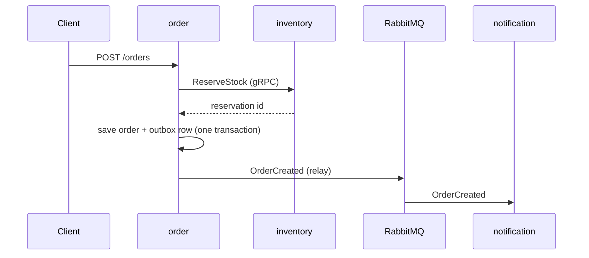
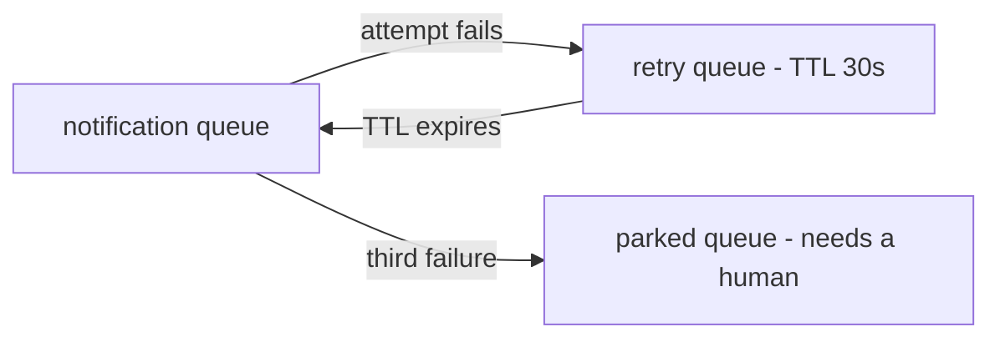

# Architecture

This document explains how the system is put together and, more importantly, **why**.
Decisions are recorded here as they are made, so everything is in one place.

- [The system](#the-system)
- [Why these three services](#why-these-three-services)
- [Why one repository](#why-one-repository)
- [How services share contracts](#how-services-share-contracts)
- [Inside a service: staying testable](#inside-a-service-staying-testable)
- [What happens when things fail halfway](#what-happens-when-things-fail-halfway)
- [What CI enforces](#what-ci-enforces)
- [Trade-offs accepted](#trade-offs-accepted)

---

## The system

Part of an order processing system, built as three services:


| Service | Responsibility | Exposes |
| --- | --- | --- |
| **order** | Accepts and manages orders | REST API, RabbitMQ events |
| **inventory** | Tracks and reserves stock | gRPC API |
| **notification** | Sends notifications | consumes events |

Each hop uses a different style on purpose. Placing an order needs an immediate
answer from inventory, so that call is synchronous. Sending a notification does not
need to block the order, and should not fail the order if the notifier is down, so
that hop is asynchronous.

---

## Why these three services

The split follows one rule: **things that change for different reasons, and break in
different ways, live apart.**

| Service | The rule it protects | Why it is on its own |
| --- | --- | --- |
| **order** | An order cannot be confirmed without reserved stock, and cannot be cancelled once shipped | Owns the order lifecycle. Changes when order rules change. |
| **inventory** | Available stock never drops below zero | Its hard problem is contention — many orders competing for the same rows at once. A completely different concurrency profile from order. |
| **notification** | none | It has no business rule at all. It is separate because it *fails* differently: email providers are slow and unreliable, and that must never stop someone placing an order. |

The clearest sign that these are real boundaries is the word "order" itself. In
order-service it is a lifecycle with states and rules. In inventory it is just an ID
attached to a reservation. In notification it is a few fields in an email template.
One word, three meanings — that is where a boundary belongs.

**Being honest about it.** At this volume, a single service with three packages would
work fine and would be less work to run. The split is here to demonstrate service
boundaries. What makes it defensible rather than decorative is that the lines follow
the rules above — each service could be scaled, deployed, and rewritten on its own.

**What would tell me the boundary is wrong.** If order and inventory always changed in
the same pull request and always deployed together, they would be one service
pretending to be two.

---

## Why one repository

All three services live in a single repository.

**It is a showcase.** A reader opens one repository and sees the whole system — how
the services are split, how they talk, and how the pieces fit.

**When I would decide differently.** Separate repositories pay off when separate teams
need to release on their own schedule — several teams owning services independently,
services written in different languages, or genuinely different release cadences. Then
separate repositories, and a schema registry such as Buf's BSR, start to pay for
themselves. None of that holds here: for around five backend developers, ten
repositories for ten services means ten CI pipelines, ten sets of dependency updates,
and ten places to change when something shared moves. Real cost, no benefit.

---

## How services share contracts

order calls inventory over gRPC, and order sends events to notification over
RabbitMQ. Both need a shared definition of the messages. Where that definition lives
is the decision.

### Options not taken

**One shared `contracts/` package holding everything.** Easy at the start. But nobody
owns it, so over time everything gets dropped in it. And a service no longer owns the
API it serves — the definition of the inventory API would sit outside inventory.

**Copy the contract into every service that needs it.** Each service keeps its own copy
of the `.proto` file. This works on day one and needs no shared code at all. But there
is no longer a single source of truth, so the copies drift — and nothing tells you.

### What is used instead

Each service keeps its public API in a small, separate Go module inside its own
folder:

```
order-service/
  go.mod                    ← the service itself (database, queue, HTTP, ...)
  api/
    go.mod                  ← the public API, and nothing else
    proto/inventory/v1/
      service.proto         gRPC methods
      events.proto          RabbitMQ message shapes
      types.proto           types shared by both
    gen/                    generated Go code (committed to git)
    topology.go             exchange and routing key names
```

`inventory-service/api` is a Go module of its own, and depends on exactly two
libraries: gRPC and protobuf.

Order then writes:

```go
import inventoryv1 ".../inventory-service/api/gen/inventory/v1"
```

and gets the client, the message types, and nothing else.

### What this gives us

**The service owns its API.** The contract lives in the service's own folder, so one
line in `CODEOWNERS` makes that ownership real rather than a convention.

**One place for everything a service exposes.** gRPC methods and RabbitMQ messages sit
side by side in the same package and share the same types. If inventory later adds a
REST API or Kafka events, they go here too. Anyone asking "what can I ask inventory
for?" has exactly one place to look.

**RabbitMQ is treated as seriously as gRPC.** The package holds both the message shape
*and* the exchange and routing key names. If someone renames a routing key, every
consumer stops compiling — instead of quietly receiving nothing in production.

**Services stay self-contained.** Nothing outside a service defines what that service
does, and there is no shared package that everyone has to edit.

**Versioning is simple.** Adding a field or a method breaks nobody, so it is just a
commit. A genuinely breaking change gets a new folder — `inventory/v2` alongside `v1`.
The server answers both while consumers move across, then `v1` is deleted.

**Consumers stay light.** Depending on inventory's API costs two libraries, so a
service can consume several APIs without its dependency list growing.

---

## Inside a service: staying testable

order-service talks to Postgres, to inventory over gRPC, and to RabbitMQ. If checking
the rule *"an order cannot be confirmed without reserved stock"* requires all three to
be running, the tests are slow and flaky, and people stop running them.

So the rules live in a package that does not know any of those exist. The domain
declares what it needs, as an interface:

```go
// internal/order/domain — imports nothing outside the standard library
type StockReserver interface {
    Reserve(ctx context.Context, sku string, qty int) (ReservationID, error)
}
```

The gRPC client satisfies it. Go makes this cheap: interfaces are satisfied
implicitly, and are declared where they are *used* rather than where they are
implemented. Dependencies end up pointing inward with no framework and no
dependency-injection container.

```
order-service/
  api/                     the public contract (above)
  internal/order/
    domain/                rules — standard library only
    app/                   use cases — orchestrates domain and ports
    adapter/
      http/                REST handlers        (inbound)
      grpc/                inventory client     (outbound)
      postgres/            order repository     (outbound)
      rabbitmq/            outbox relay         (outbound)
  cmd/order/main.go        the only place everything is wired together
```

This is ports and adapters — also called hexagonal, and close to what clean
architecture describes. The name matters less than the property it buys:

> `go test ./internal/order/domain/...` needs no Docker, no network, and no other
> service running.

That is a claim CI can check, and it does.

Tests then stack up:

- **domain rules** — many, in milliseconds, no infrastructure
- **use cases** — against in-memory fakes of the ports
- **adapters** — a few, against real Postgres and RabbitMQ via testcontainers
- **end to end** — one run through all three services

**Not every service needs this.** notification-service consumes an event and calls an
email provider. It has no rule that can fail, so it gets a consumer and an adapter —
two pieces, not four. Layering earns its cost where there are rules to protect;
applying it everywhere by default is ceremony.

**The trap.** A `domain/` package that imports nothing but holds only structs and
getters, with all the real logic in `app/`. That looks like clean architecture and is
not. The test is simple: **can code in `domain/` return a business error?** If it
cannot, the rules are in the wrong place.

---

## What happens when things fail halfway

Placing an order crosses three services and two kinds of transport, so partial failure
is normal rather than exceptional.



| What fails | The risk | How it is handled |
| --- | --- | --- |
| `ReserveStock` times out — did it reserve or not? | Retrying could reserve the stock twice | order sends a reservation key it generates itself. Inventory treats a repeat of the same key as the same reservation, so retrying is safe. |
| Reservation succeeds, saving the order fails | Stock held for an order that does not exist | Reservations expire. Inventory releases anything unconfirmed after a set time, so the leak repairs itself — no second call that could also fail. |
| Order saved, publishing `OrderCreated` fails | Order exists, notification never sent | The order row and an outbox row are written in **one** database transaction. A relay reads the outbox and publishes. The commit is the only thing that has to succeed. |
| Relay publishes, then dies before marking the row sent | The event goes out twice | Accepted. Delivery is at-least-once. |
| notification receives the same event twice | The customer gets two emails | Consumers record the event IDs they have handled and skip repeats. |
| inventory is down | — | `POST /orders` fails fast with a clear error and no order is created. A confirmed order with no stock behind it is worse than a rejected one. |

### When a consumer keeps failing

The table above covers messages that go missing. This covers messages that arrive and
cannot be processed.

If notification's email provider is down, RabbitMQ redelivers the message. With no
limit it redelivers forever: one bad message spins in a loop and holds up everything
behind it.

The policy is **three attempts, then park it**:



The mechanism is RabbitMQ's own. A failed message is rejected with `requeue=false`,
which sends it to the retry queue instead of back to the front of the line. The retry
queue has no consumer and a fixed TTL, so when the message expires it is dead-lettered
back to the original queue and tried again. RabbitMQ counts the round trips in the
`x-death` header; on the third failure the consumer routes the message to the parked
queue.

Rejecting with `requeue=true` instead would put the message straight back at the head
of the queue — a hot loop that hammers the failing provider with no pause between
attempts. The trip through the retry queue is what buys the delay.

**Retrying only helps transient failures.** A message that cannot be decoded will fail
the same way three times, so retrying it wastes three attempts and delays the alert.
Consumers separate the two cases:

| Failure | Example | What happens |
| --- | --- | --- |
| Transient | provider timeout, network blip | retried, up to three times |
| Permanent | message will not decode, refers to an order that does not exist | parked immediately, no retries |

**Each service sets its own policy.** How many attempts, and how long to wait between
them, depends on what that consumer talks to — notification calls a flaky third party;
a consumer doing a local write does not. The publisher neither knows nor cares. This
follows the same line drawn for contracts above: exchange and routing keys are shared
because they *are* the contract, while retry counts and dead-letter queues are the
consumer's own business and stay inside the consumer.

**A parked queue nobody watches is silent data loss.** Depth above zero raises an
alert.

### The rules that come out of this

Four rules fall out, and they hold everywhere in the system:

1. **Every call that changes something carries a key**, so retrying is safe.
2. **Every hold on another service's data expires**, so nothing leaks when a later step
   never happens.
3. **Every consumer is idempotent**, because every hop delivers at least once.
4. **Every consumer gives up eventually**, and parks the message where somebody will
   see it. Retrying forever hides a problem instead of surfacing it.

---

## What CI enforces

Because everything is in one repository, these checks are cheap and run on every pull
request:

| Check | Catches |
| --- | --- |
| `go build ./...` | inventory removes a method order still calls — the gRPC client is verified against the server's contract **before merge** |
| `buf breaking` | a change to `v1` that would break existing consumers |
| `buf generate` + `git diff --exit-code` | someone edited a `.proto` and forgot to regenerate |
| import-boundary script | one service importing another service's internal code instead of its `api` package |
| domain-purity script | any `domain/` package importing a database, network, or queue library |
| `go test ./internal/.../domain/...` with nothing else running | the domain quietly growing a dependency on infrastructure |

The first row is the one worth pausing on. In separate repositories, a client calling
a method the server no longer has is a runtime failure found in production. Here it is
a compiler error found in the pull request that caused it.

---

## Trade-offs accepted

**Generated code is committed to git.** It makes diffs noisier. In exchange,
`git clone && go build ./...` works with no extra tools installed. This is standard in
Go: `k8s.io/api` and etcd's `api` module both do it.

**One repository means CI must eventually learn to build only what changed.** Fine at
three services; worth solving before it is thirty.

**This is the right shape for one team.** At five teams and eight services I would
revisit it, most likely by moving contracts to a schema registry.
