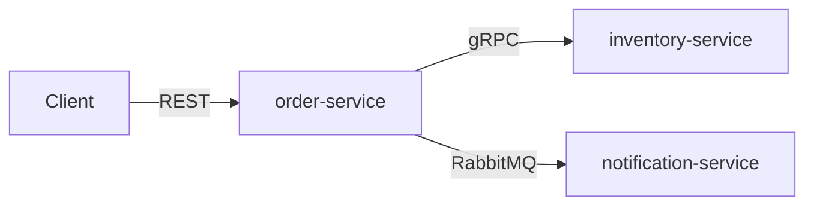
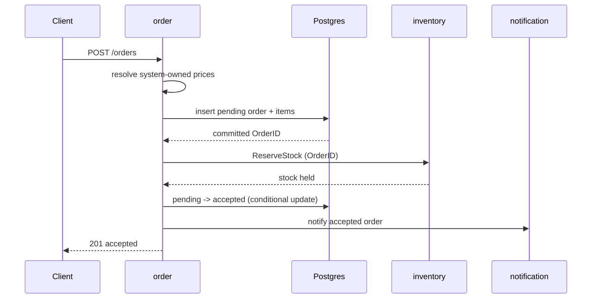
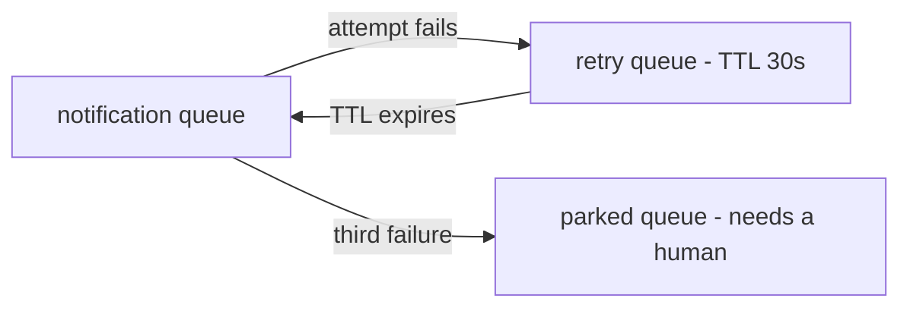

# Architecture

This document explains how the system is put together and, more importantly, **why**.
Decisions are recorded here as they are made, so everything is in one place.

- [The system](#the-system)
- [Why these three services](#why-these-three-services)
- [Why one repository](#why-one-repository)
- [How services share contracts](#how-services-share-contracts)
- [Inside a service: staying testable](#inside-a-service-staying-testable)
- [What happens when things fail halfway](#what-happens-when-things-fail-halfway)
- [How inventory survives contention](#how-inventory-survives-contention)
- [What CI enforces](#what-ci-enforces)
- [Trade-offs accepted](#trade-offs-accepted)

---

## The system

The intended showcase is an order processing system with three service boundaries:



| Service | Responsibility | Exposes |
| --- | --- | --- |
| **order** | Accepts and manages orders | REST API, RabbitMQ events |
| **inventory** | Tracks and reserves stock | gRPC API |
| **notification** | Sends notifications | consumes events |

Each hop uses a different style on purpose. Placing an order needs an immediate
answer from inventory, so that call is synchronous. Sending a notification does not
need to block the order, and should not fail the order if the notifier is down, so
that hop is asynchronous.

The current implemented slice is deliberately smaller: `order-service` exposes
`POST /orders` and calls a real `inventory-service` over gRPC. The product catalog and
the notifier are still temporary in-process adapters, and RabbitMQ, the transactional
outbox, and notification-service remain future work.

---

## Why these three services

The split follows one rule: **things that change for different reasons, and break in
different ways, live apart.**

| Service | The rule it protects | Why it is on its own |
| --- | --- | --- |
| **order** | An order cannot be accepted without reserved stock, and cannot be cancelled once shipped | Owns the order lifecycle. Changes when order rules change. |
| **inventory** | Available stock never drops below zero | Its hard problem is contention — many orders competing for the same rows at once. A completely different concurrency profile from order. |
| **notification** | none | It has no business rule at all. It is separate because it *fails* differently: email providers are slow and unreliable, and that must never stop someone placing an order. |

The clearest sign that these are real boundaries is the word "order" itself. In
order-service it is a lifecycle with states and rules. In inventory it is just an ID
attached to a reservation. In notification it is a few fields in an email template.
One word, three meanings — that is where a boundary belongs.

**Being honest about it.** At this volume, a single service with three packages would
work fine and would be less work to run. The split is here to demonstrate service
boundaries. What makes it defensible rather than decorative is that the lines follow
the rules above — each service could be scaled, deployed, and rewritten on its own.

**What would tell me the boundary is wrong.** If order and inventory always changed in
the same pull request and always deployed together, they would be one service
pretending to be two.

---

## Why one repository

All three services live in a single repository.

**It is a showcase.** A reader opens one repository and sees the whole system — how
the services are split, how they talk, and how the pieces fit.

**When I would decide differently.** Separate repositories pay off when separate teams
need to release on their own schedule — several teams owning services independently,
services written in different languages, or genuinely different release cadences. Then
separate repositories, and a schema registry such as Buf's BSR, start to pay for
themselves. None of that holds here: for around five backend developers, ten
repositories for ten services means ten CI pipelines, ten sets of dependency updates,
and ten places to change when something shared moves. Real cost, no benefit.

---

## How services share contracts

order-service calls inventory over gRPC, and will send events to notification over
RabbitMQ. Both need a shared definition of the messages. The gRPC half of this is
implemented; the RabbitMQ half is still design direction.

### Options not taken

**One shared `contracts/` package holding everything.** Easy at the start. But nobody
owns it, so over time everything gets dropped in it. And a service no longer owns the
API it serves — the definition of the inventory API would sit outside inventory.

**Copy the contract into every service that needs it.** Each service keeps its own copy
of the `.proto` file. This works on day one and needs no shared code at all. But there
is no longer a single source of truth, so the copies drift — and nothing tells you.

### Contract ownership

Each service keeps its public API in a small, separate Go module inside its own folder:

```
inventory-service/
  go.mod                    ← the service itself (database, gRPC server, ...)
  api/
    go.mod                  ← the public API, and nothing else
    proto/inventory/v1/
      service.proto         gRPC methods and message shapes
    gen/inventory/v1/       generated Go code (committed to git)
```

`inventory-service/api` is a Go module of its own whose entire dependency list is two
libraries: gRPC and protobuf. That is checkable rather than aspirational — open its
`go.mod`.

Order writes:

```go
import inventoryv1 ".../inventory-service/api/gen/inventory/v1"
```

and gets the client, the message types, and nothing else.

**How the modules find each other.** A `replace` directive in `order-service/go.mod`
points at `../inventory-service/api`. There is deliberately no `go.work`: a workspace
would need every one of its `use` directories present at build time, but each service's
Dockerfile copies only the directories it needs, so the workspace would have to be
rewritten during the image build. A `replace` behaves identically on a laptop and inside
Docker, and one mechanism is easier to reason about than two that can disagree.

**buf owns the generation.** `buf.gen.yaml` pins remote plugin versions, so `make proto`
produces byte-identical output on any machine without anyone installing
`protoc-gen-go`. `make proto-lint` enforces the standard naming rules and
`make proto-breaking` compares against `main`, which is the part that turns "we have a
`.proto`" into an actual contract.

### What this gives us

**The service owns its API.** The contract lives in the service's own folder, so one
line in `CODEOWNERS` makes that ownership real rather than a convention.

**One place for everything a service exposes.** gRPC methods and RabbitMQ messages sit
side by side in the same package and share the same types. If inventory later adds a
REST API or Kafka events, they go here too. Anyone asking "what can I ask inventory
for?" has exactly one place to look.

**RabbitMQ is treated as seriously as gRPC.** The package holds both the message shape
*and* the exchange and routing key names. If someone renames a routing key, every
consumer stops compiling — instead of quietly receiving nothing in production.

**Services stay self-contained.** Nothing outside a service defines what that service
does, and there is no shared package that everyone has to edit.

**Versioning is simple.** Adding a field or a method breaks nobody, so it is just a
commit. A genuinely breaking change gets a new folder — `inventory/v2` alongside `v1`.
The server answers both while consumers move across, then `v1` is deleted.

**Consumers stay light.** Depending on inventory's API costs two libraries, so a
service can consume several APIs without its dependency list growing.

---

## Inside a service: staying testable

order-service persists to Postgres and is designed to talk to inventory and
notification through replaceable adapters. If checking the rule *"an order cannot be
accepted without reserved stock"* requires infrastructure to be running, the tests
are slow and flaky, and people stop running them.

The rules live in a package that does not know any of those exist. The application
layer declares the external capability it needs as a port:

```go
// internal/order/application
type InventoryReserver interface {
    Reserve(ctx context.Context, request ReservationRequest) (domain.ReservationID, error)
}
```

The temporary in-process adapter satisfies it today; a later gRPC client can satisfy
the same port. Go makes this cheap: interfaces are satisfied
implicitly, and are declared where they are *used* rather than where they are
implemented. Dependencies end up pointing inward with no framework and no
dependency-injection container.

```
order-service/
  internal/
    order/
      domain/                rules — standard library only
      application/           use cases — orchestrates domain and ports
      adapter/
        inbound/httpgin/     REST handlers
        outbound/postgres/   order repository
        outbound/catalogstub/       temporary price catalog
        outbound/inventorystub/     temporary inventory adapter
        outbound/notificationlog/   temporary notification adapter
      wiring/                builds the order context
    platform/                config, logger, database pool, HTTP server
    bootstrap/               builds the process
  cmd/order/main.go          turns an error into an exit code
```

This is ports and adapters — also called hexagonal, and close to what clean
architecture describes. The name matters less than the property it buys:

> `go test ./internal/order/domain/...` needs no Docker, no network, and no other
> service running.

That property is exercised by the current test suite and is suitable for a dedicated
import-boundary CI check later.

### Where everything is wired

Something has to know that `OrderRepository` means Postgres. That knowledge sits at the
outermost ring, in exactly two packages: `internal/order/wiring` builds the order context
(adapters, use cases, routes), and `internal/bootstrap` builds the process around it
(config, the pool, the HTTP server, shutdown). `main` does neither — it turns an error
into an exit code.

The split is what keeps it from growing into a mess. `internal/platform/httpserver`
receives an already-built `http.Handler` and never learns what a use case is, so the
inventory service reuses it verbatim. And because `wiring` returns a struct rather than a
bare handler, another process such as a future outbox relay can be added later without
either package changing shape — the order context can eventually run more than one
transport.

This gives a rule with teeth: **only those two packages may import both a concrete adapter
and the application layer.** Everything else stays importable without dragging in a
database driver, which is the enforceable form of "the domain does not depend on
infrastructure".

It is a composition root, not a service locator. Dependencies are constructed explicitly
and passed in, so a missing one fails to compile. A registry — `container.Get("create_order")`,
or a reflection-based container like `fx` or `dig` — hides the graph and moves wiring
mistakes to runtime, which trades away the main thing Go offers here.

Tests then stack up:

- **domain rules** — many, in milliseconds, no infrastructure
- **use cases** — against in-memory fakes of the ports
- **adapters** — the repository against real Postgres via testcontainers
- **end to end** — deferred until the remote services exist

**Not every service needs this.** notification-service consumes an event and calls an
email provider. It has no rule that can fail, so it gets a consumer and an adapter —
two pieces, not four. Layering earns its cost where there are rules to protect;
applying it everywhere by default is ceremony.

**The trap.** A `domain/` package that imports nothing but holds only structs and
getters, with all the real logic in `app/`. That looks like clean architecture and is
not. The test is simple: **can code in `domain/` return a business error?** If it
cannot, the rules are in the wrong place.

### Why inventory-service has fewer layers

inventory-service applies that test and fails it, so it has **no `domain/` package at
all** — application, two adapters, wiring, and nothing else.

Its single rule is *available stock never drops below zero*, and that is a **contention**
invariant rather than a modelling one. Contention invariants cannot be enforced in
memory: an aggregate that reads stock, decides, and writes is a read-modify-write race
however carefully it is modelled. Nothing an in-process object does can stop a second
process reading the same row at the same instant. The rule therefore lives where the
contention is resolved — in one conditional `UPDATE` and one `CHECK` constraint.

A `domain/` package here would hold structs and getters, which is precisely the trap
above. Order-service has four pieces because it has an aggregate with a lifecycle and
transitions that can be refused; inventory has three because it does not. Mirroring the
larger service by reflex would have proved the layering was a template rather than a
decision.

The visible consequence: inventory has no HTTP server, no Gin, and a `go.mod` noticeably
shorter than order's.

---

## What happens when things fail halfway

Order creation deliberately persists local state before making the inventory call.
There is no database transaction open across that external boundary.



| What fails | The risk | How it is handled |
| --- | --- | --- |
| Initial order insert fails | Inventory could reserve for an order that was never stored | Inventory is not called; the API returns `500`. |
| Inventory is unavailable | An ambiguous call could be repeated and reserve twice | The same persisted OrderID and item lines are used for at most three attempts, with 100 ms and 200 ms waits. Inventory treats OrderID as its idempotency key. After the third failure, the order remains `pending` and the API returns `503`. |
| Inventory reports insufficient stock | The order cannot be accepted | Inventory is not retried. The order is conditionally changed from `pending` to `rejected`, and the API returns `409`. |
| Reservation succeeds but saving `accepted` fails | Inventory may hold stock while PostgreSQL still says `pending` | The API returns `500`. A later request with the same `Idempotency-Key` resumes the persisted order; the repeated OrderID returns the original reservation. There is currently no automated recovery. |
| Two requests process the same pending order | Both may try to finish it | Both inventory calls are safe because they carry the same OrderID. The database update requires the expected `pending` state; the loser reloads and interprets the state that won. |
| Notification fails after acceptance | Turning a durable accepted order into an API failure would invite unsafe client retries | The failure is logged and swallowed. A transactional outbox is the future replacement, but is not implemented here. |

The API never returns `pending` as success. A new accepted order returns `201`; an
accepted idempotent replay returns `200`. A rejected replay returns the same
insufficient-stock outcome without calling inventory again. A pending replay resumes
inventory processing from the stored order snapshot, never from a new request body.

This leaves one deliberate limitation: without another client retry, a pending order
and any associated reservation may remain pending indefinitely. Inventory expiry and
automated recovery are outside the current boundary.

Payment is also outside this lifecycle. `accepted` records the outcome of this order
and inventory workflow and is not a payment status. A future payment workflow should
introduce explicit payment-related states and policies rather than overload it.

### Future messaging policy (not implemented)

The transactional outbox, RabbitMQ relay, and consumer described below are design
direction only. They remain out of scope for the current implementation.

If notification's email provider is down, RabbitMQ redelivers the message. With no
limit it redelivers forever: one bad message spins in a loop and holds up everything
behind it.

The policy is **three attempts, then park it**:



The mechanism is RabbitMQ's own. A failed message is rejected with `requeue=false`,
which sends it to the retry queue instead of back to the front of the line. The retry
queue has no consumer and a fixed TTL, so when the message expires it is dead-lettered
back to the original queue and tried again. RabbitMQ counts the round trips in the
`x-death` header; on the third failure the consumer routes the message to the parked
queue.

Rejecting with `requeue=true` instead would put the message straight back at the head
of the queue — a hot loop that hammers the failing provider with no pause between
attempts. The trip through the retry queue is what buys the delay.

**Retrying only helps transient failures.** A message that cannot be decoded will fail
the same way three times, so retrying it wastes three attempts and delays the alert.
Consumers separate the two cases:

| Failure | Example | What happens |
| --- | --- | --- |
| Transient | provider timeout, network blip | retried, up to three times |
| Permanent | message will not decode, refers to an order that does not exist | parked immediately, no retries |

**Each service sets its own policy.** How many attempts, and how long to wait between
them, depends on what that consumer talks to — notification calls a flaky third party;
a consumer doing a local write does not. The publisher neither knows nor cares. This
follows the same line drawn for contracts above: exchange and routing keys are shared
because they *are* the contract, while retry counts and dead-letter queues are the
consumer's own business and stay inside the consumer.

**A parked queue nobody watches is silent data loss.** Depth above zero raises an
alert.

---

## How inventory survives contention

Many orders compete for the same stock rows at once. This is inventory-service's whole
problem, and the answer is one statement:

```sql
UPDATE stock_items
   SET reserved = reserved + $2
 WHERE product_sku = $1
   AND on_hand - reserved >= $2
```

Zero rows affected means the reservation failed. There is **no `SELECT … FOR UPDATE`
first and no `SERIALIZABLE`**, because both exist to close a read-then-decide gap that
this statement does not have: the check and the write are the same operation.

The mechanism is worth stating because it is not obvious. Under `READ COMMITTED`, a
transaction that blocks here on a row another transaction holds does **not** re-run
against its original snapshot — PostgreSQL re-evaluates the `WHERE` clause against the
newly committed version once the lock is released. So the loser sees the winner's
decrement and matches zero rows. Lost updates are impossible without any explicit
locking.

Underneath it, one constraint states the rule the database itself will not let anything
violate:

```sql
CONSTRAINT stock_items_reserved_within_stock CHECK (reserved <= on_hand)
```

### Where each race is handled

| Race | How it is resolved |
| --- | --- |
| Two orders want the last unit | The conditional `UPDATE`; the loser's predicate is re-evaluated after the winner commits |
| Orders `[A, B]` and `[B, A]` lock each other | Lines are **sorted by SKU** before any row is touched, so a lock cycle cannot form |
| The same order id arrives twice at once | `order_id` is the primary key of `reservations`, claimed with `INSERT … ON CONFLICT DO NOTHING RETURNING` |
| A response is lost and the caller retries | The recorded outcome is replayed; stock does not move again |
| Line 3 of 5 has no stock | The transaction rolls back, putting back what lines 1–2 took |
| Duplicate SKUs in one request | Summed during canonicalisation, with a checked sum that cannot overflow |
| The same order id with different lines | Stored lines are compared; the call is refused rather than confirming stock nobody reserved |

**Sorting is load-bearing, not tidiness.** Removing it and running the same concurrent
test produces `SQLSTATE 40P01`, PostgreSQL killing one side of a deadlock. That is
verified rather than assumed.

**`ON CONFLICT DO NOTHING`, not a caught `23505`.** A raw unique violation aborts the
transaction: every later statement fails with `25P02` until rollback, so there is no way
to inspect the conflict and carry on. `ON CONFLICT` returns zero rows instead of
erroring, and it blocks until the conflicting transaction resolves — so zero rows means
the winner has already committed and the retry is guaranteed to see it.

**Only successes are recorded.** `reservations` holds stock that is actually being held,
and nothing else. A failed attempt writes no row, so retrying the same order id is a
fresh attempt — an order refused while a product was sold out succeeds once the
warehouse restocks.

Storing failures was considered and rejected. It would have bought the property that one
order id always gets the same answer, but at the price of permanently poisoning an order
that could later be filled, which is the wrong trade for a shop. A failed reservation is
not a reservation; it is an event, and it is already recorded by the gRPC interceptor
with its status code. Keeping it out of the table also lets `reservations` carry a
foreign key to `stock_items`, which would otherwise have to be dropped to make unknown
products storable — and that foreign key then becomes the unknown-product check, so no
separate existence query is needed at all.

**Two tables, not three.** There is no separate reservation identifier and no header row
to hold one. An order holds stock here at most once, so its own order id already names
the hold; a second identifier would be a synonym, and a header table existing only to
carry it would be a table whose entire content is another table's key. `order-service`
therefore records nothing but `accepted`, which is itself the statement that the stock
was secured.

### What this leaves open

A reservation is permanent. Nothing expires or releases it, so an order that fails after
its stock is held keeps that stock indefinitely. This is the same limitation recorded
above, seen from the other side, and it is why `reservations` stores the products and
not just the order id: it is the only record of what stranded stock is being held for.

---

### The rules that come out of this

Three rules guide the distributed design:

1. **Every retried state-changing call carries a stable key**, so retrying is safe.
2. **Every future message consumer must be idempotent**, because message delivery will
   be at least once.
3. **Every future consumer must give up eventually**, and park the message where
   somebody will see it. Retrying forever hides a problem instead of surfacing it.

---

## What CI enforces

GitHub Actions ([`.github/workflows/ci.yml`](.github/workflows/ci.yml)) runs `go vet`, the unit
tests, and the `testcontainers` integration tests on every push and on every pull request
targeting `main`. It runs them through the `make` targets rather than its own copy of the
commands, and those targets loop over every Go module the `Makefile` discovers — so a service
added later is covered without editing the workflow. Compose validation and `buf lint` remain
local, in `make check`.

The most valuable thing this already catches is a cross-service contract break. In separate
repositories, a client calling a method the server no longer has becomes a runtime failure.
Here `order-service/go.mod` replaces the contract module with a local path
(`replace … => ../inventory-service/api`), so inventory removing a method order still calls is a
compile error in the pull request that caused it.

### Checks still to add

As the deferred contracts and adapters arrive, CI should grow the following rather than claiming
they already run:

| Check | Catches |
| --- | --- |
| `buf breaking` | a change to `v1` that would break existing consumers |
| `buf generate` + `git diff --exit-code` | someone edited a `.proto` and forgot to regenerate |
| `gofmt -l` | unformatted code (`make fmt` rewrites files, so CI needs the read-only form) |
| import-boundary script | one service importing another service's internal code instead of its `api` package |
| domain-purity script | any `domain/` package importing a database, network, or queue library |
| `go test ./internal/.../domain/...` with nothing else running | the domain quietly growing a dependency on infrastructure |

---

## Trade-offs accepted

**Generated code is committed to git.** It makes diffs noisier. In exchange,
`git clone && go build ./...` works with no extra tools installed. This is standard in
Go: `k8s.io/api` and etcd's `api` module both do it.

**One repository means CI must eventually learn to build only what changed.** Fine at
three services; worth solving before it is thirty.

**This is the right shape for one team.** At five teams and eight services I would
revisit it, most likely by moving contracts to a schema registry.
