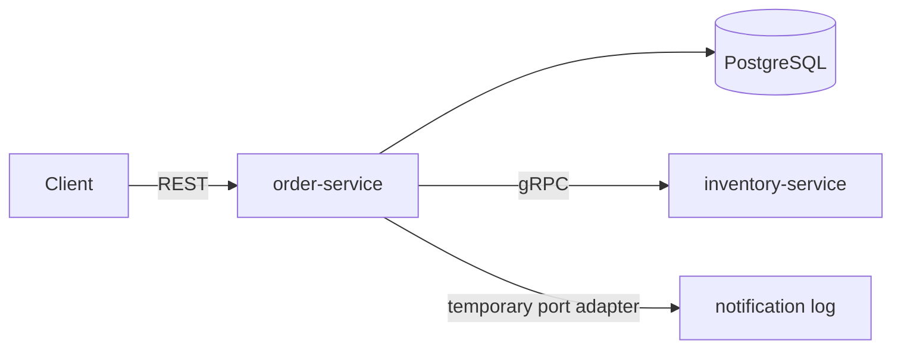

# Go Order System

A small order processing system built as three Go services — written to show how I
think about backend architecture, not to sell a product.

The code is deliberately modest in size. The reasoning behind it is the point, and it
lives in **[ARCHITECTURE.md](ARCHITECTURE.md)**.

---

## What it does

A client places an order through `POST /orders`. The order service resolves prices
from a system-owned catalog, saves a `pending` order, reserves stock, then records the
order as `accepted` or `rejected`. inventory-service is real and is called over gRPC;
the catalog and notification adapters are still temporary in-process implementations,
and RabbitMQ and notification-service are deliberately deferred.



| Boundary | Responsibility | Current implementation |
| --- | --- | --- |
| **order** | Accepts and manages orders | REST API and PostgreSQL repository |
| **inventory** | Tracks and reserves stock | gRPC API |
| **notification** | Sends notifications | structured-log stub; messaging is planned |

That is the entire feature set, and it is small on purpose: enough surface for the
problems worth showing — partial failure, contracts between services, consistency
across a network — without the noise of a real product.

An order is an immutable snapshot once it has been placed. The customer may change
the cart before checkout, but an accepted order's items, quantities, and captured
prices are not edited afterward. Changing the purchase would require a separate
cancellation operation followed by a new order; cancellation is not implemented in
the current scope. Immutability keeps the order consistent with its inventory
reservation, notification history, and any later payment or fulfilment records. The
showcase deliberately does not model a mutable cart.

### Why the order is persisted before inventory is reserved

The create-order workflow first commits the order and its items with a
`pending` status. It then asks inventory to reserve stock using the persisted order ID
and, on success, conditionally updates the order to `accepted` in a second short
database operation.

```text
resolve prices → commit pending order → reserve inventory → commit accepted or rejected
```

This ordering was chosen for four reasons. It is usually faster because most requests
need only one network call to inventory rather than separate check and reserve
calls. It gives inventory a real, durable order ID to store with the reservation. It
keeps database transactions short instead of holding locks and a pool connection while
waiting on another service. Most importantly, a failure leaves a visible `pending`
order rather than partial work that exists only inside inventory. A later request with
the same `Idempotency-Key` resumes processing from that stored snapshot.

The first inventory operation must reserve stock, not merely check availability. A
separate check is subject to a race: two customers can both observe the last unit as
available before either tries to reserve it. Inventory therefore treats the order ID as
an idempotency key: the first call creates the reservation, and retries with the same
order ID and lines return that reservation without decrementing stock again.

If inventory reports insufficient stock, the pending order transitions to `rejected`
and the API returns `409`. If inventory is unavailable, the request makes at most three
attempts, waiting 100 ms and then 200 ms between them. After the third failure, the
order remains `pending` and the API returns `503`. If inventory succeeds but the state
update fails, the stored order also remains `pending` and the API returns `500`.

The API never reports `pending` as a successful result. A successful initial request
returns `201` with an `accepted` order; an accepted idempotent replay returns `200`.
Concurrent transitions use an expected-status update, so only one request can change
`pending` and a loser reloads the state that won.

The two database commits and the inventory call are deliberately not wrapped in one
transaction. A local PostgreSQL transaction cannot atomically include another service,
and keeping it open across a network call would reduce throughput without removing the
possibility of partial failure. The durable status transitions make those failures
explicit.

Automated recovery and inventory-reservation expiry are intentionally not implemented.
Without a later client retry using the same idempotency key, an order—and possibly an
inventory reservation—may remain `pending` indefinitely. That is an accepted limitation
of the current scope, not a claim that the failure has been automatically repaired.

Payment is outside the current order lifecycle. `accepted` means the order has reserved
inventory and has been accepted by this workflow; it does not represent a payment
state. A future payment design would add its own explicit states and policies rather
than changing the meaning of `accepted`.

---

## How inventory holds stock safely

Reserving stock is the one place in this system where independent requests genuinely
collide. Two customers reach for the last unit. The same request arrives twice because a
retry overtook a slow response. Two different orders share three of their five products.
All of these happen, and none of them may result in stock being promised twice.

The whole design rests on **two rules**. Every behaviour below is a consequence of one of
them.

1. **The order id is the identity of the reservation.**
2. **Products are always touched in sorted order.**

The first rule makes duplicates safe. The second makes deadlock impossible. This section
walks through both in full, because this is the part of the project most worth reading
closely.

### Rule 1 — the order id is the identity of the reservation

`reservations` is keyed by `(order_id, product_sku)`. There is no separate reservation
identifier, and idempotency is not a lookup bolted onto the side: it *is* the table's
primary key. An order can hold a given product exactly once, and the database is what
enforces that.

#### What happens when the same request arrives twice at once

order-service sends a reserve request, does not get an answer in time, and sends it
again. Now two copies of the same request are running side by side, carrying the same
order id.

Each one does the same two steps:

1. **Look.** Is there already a reservation for this order id?
2. If nothing is there, **claim it.**

Both do step 1 at the same instant. Both see nothing. Both go to step 2 — and both try to
write the same row.

The database lets exactly one of them through. Say request **A** wins. Request **B** is
told *"someone else already claimed this."*

The important part is **when** B is told. The claim uses
`INSERT … ON CONFLICT DO NOTHING RETURNING`, which does not fail on a conflict — it
**blocks** while the competing transaction is still in flight, and returns zero rows only
once that transaction has committed. So by the moment B learns it lost, A is already
finished and durable. Not nearly finished. Finished.

B therefore goes back and looks again, and it **will** find the reservation. That is a
guarantee of the statement, not a hope.

#### Why B reads again instead of just answering

This second read is easy to mistake for a retry. It is not. B is not attempting the same
action hoping for a better outcome — it is fetching information it does not have.

When B lost, the database told it only that the order id was taken. It did not say *what
was claimed*. And B still has a caller waiting, which needs one of two very different
answers:

| What the winner claimed | The correct answer to B's caller |
| --- | --- |
| The **same** products B asked for | **Yes — the stock is held.** This is the normal duplicate: order-service retried, and the retry must succeed. |
| **Different** products, under the same order id | **Conflict.** The caller has reused an order id for something else. |

B cannot tell these apart without reading, and neither shortcut is acceptable:

- **Always answer "yes"** — then in the second case, order-service is told stock is held
  for products nobody reserved. The order is accepted and never packed. That is the worst
  bug this service could have.
- **Always answer "error"** — then the ordinary duplicate fails, which breaks the one
  property the order id exists to provide.

One extra read is cheap. Guessing is not.

#### Why the loop is bounded at two passes, not three

- **Pass 1** — look, find nothing, claim, lose the race.
- **Pass 2** — look again. This *must* find the winner, for the reason above. It either
  confirms the reservation or reports a conflict. Either way it returns.

Pass 2 never falls through, so a third pass is unreachable. `claimAttempts = 2` is an
exact statement of what a correct run needs, not a safety margin. A third pass could only
execute if the store broke its own contract — and it would then fail identically, one
round trip later, with a worse error message. The constant says what is true; the terminal
error is a genuine "the store is broken" signal rather than something plausibly reachable.

#### A failed winner does not block the retry

If A fails — say a later product is sold out — its transaction rolls back and leaves
nothing behind. B, which was blocked waiting on A's row, is released and its insert now
*succeeds*, so B simply proceeds with a real attempt of its own. A failure never poisons
the order id for the request behind it.

### Rule 2 — products are always touched in sorted order

This rule exists for a different collision: **two different orders that share products.**

- **Order-1** wants A, B, C, D, E
- **Order-2** wants B, C, D
- They arrive at the same moment.

They do not compete for a reservation row at all — different order ids mean different
rows, so Rule 1 is not involved. They compete for the **stock rows** of B, C and D. A row
can be modified by one transaction at a time, so one of them has to wait.

Before either request reaches the database, its lines are sorted. So both walk forward
through the alphabet and neither ever goes backwards:

| Step | Order-1 | Order-2 |
| --- | --- | --- |
| 1 | takes **A** | takes **B** |
| 2 | wants B — **waits** | takes **C** |
| 3 | waiting | takes **D** |
| 4 | waiting | **commits**, releasing B, C, D |
| 5 | takes B, C, D, E — **commits** | — |

Order-2 waited for nobody. It needed only B, C and D, it got all three, it finished, and
finishing released Order-1.

That is the general property: **whoever holds the earliest shared product is in front, and
the one in front never waits for the one behind.** Everything the trailing request holds
is further along the alphabet, which the leading request has not reached yet. So the
leader can always finish, and finishing always unblocks the follower. A cycle cannot form.

#### What it looks like without the sort

Let Order-1 walk B → D and Order-2 walk D → B:

| Step | Order-1 | Order-2 |
| --- | --- | --- |
| 1 | takes **B** | takes **D** |
| 2 | wants D — waits for Order-2 | wants B — waits for Order-1 |

Each holds what the other needs. Neither can move. PostgreSQL detects the cycle after
roughly a second and kills one side with `SQLSTATE 40P01`, and the customer sees a failure
that had nothing to do with stock.

**This is verified, not assumed.** Removing the sort and rerunning the concurrency test
reproduces `40P01`; restoring it produces zero failures across the same run. Sorting turns
an arbitrary-order problem into a one-direction problem, and a one-direction race cannot
close a loop.

The same reasoning fixes a second ordering inside each line: the reservation row is
claimed **before** its stock row is touched. Taking stock first would leave a transaction
holding a stock row while waiting on a reservation row held by a competing request for the
same order id — which wants that same stock row. Claiming first means a waiter holds
nothing.

### The statement that decides who gets the last unit

Availability is never read and then acted on. The check and the write are one statement:

```sql
UPDATE stock_items
   SET reserved = reserved + $2, updated_at = now()
 WHERE product_sku = $1
   AND on_hand - reserved >= $2
```

Zero rows affected means that product could not be filled.

There is **no `SELECT … FOR UPDATE` and no `SERIALIZABLE`**, because both exist to close a
read-then-decide gap that this statement does not have. Under `READ COMMITTED`, a
transaction that blocks here does not resume against its original snapshot: PostgreSQL
re-evaluates the `WHERE` clause against the newly committed row once the lock is released.
The loser therefore sees the winner's decrement and matches zero rows. Lost updates are
impossible with no explicit locking at all.

Underneath it sits the rule the database itself will not allow anything to break:

```sql
CONSTRAINT stock_items_reserved_within_stock CHECK (reserved <= on_hand)
```

"Available stock never drops below zero" is a constraint, not a comment and not a test.
Every guard above it may contain a bug; this one cannot be violated.

### Why the row is written before the stock is checked

The obvious shape is the opposite one: read the stock, see whether there is enough, and
only then write anything. It was considered and rejected, for three separate reasons.

**A plain read cannot decide anything.** A `SELECT` reports what was true a moment ago.
Between the read and the write another order can take the last unit, so after checking you
still need the conditional `UPDATE` anyway. The check removes no query. It adds one, on
every request including the ones that succeed, to fail slightly earlier on the ones that
do not.

**Locking the row explicitly is redundant, and this is measurable.** The obvious repair is
to hold the row across the decision:

```sql
SELECT on_hand, reserved FROM stock_items WHERE product_sku = $1 FOR NO KEY UPDATE
```

`FOR NO KEY UPDATE` is the correct mode to reach for here — plain `FOR UPDATE` conflicts
with `FOR KEY SHARE`, which is what a foreign key reference takes on its parent row, so it
would block other orders from inserting their own reservation rows for that SKU.

But PostgreSQL grants exactly `FOR NO KEY UPDATE` to any `UPDATE` that does not modify a
key column, and this one touches only `reserved` and `updated_at`. Holding an `UPDATE`
open on a stock row and probing from a second session confirms it: `FOR KEY SHARE`
succeeds, and `FOR NO KEY UPDATE` blocks. The lock is already exactly the one the explicit
`SELECT` would take — one round trip earlier, followed by the `UPDATE` that takes it
anyway.

An explicit lock earns its place when the decision cannot be expressed as a `WHERE`
clause: read the row, call another service or apply a rule that needs application code,
then write. The classic bank transfer is that shape. This decision is one comparison,
`on_hand - reserved >= $2`, and once the whole decision fits inside the statement that
acts on it, the lock is a synonym for what the statement already does.

**Reversing the order reintroduces a deadlock.** This is the reason that survives even if
the two above did not. Taking stock first means holding a stock row while going on to
insert a reservation row — and a competing request carrying the same order id is doing the
mirror image:

| | Request 1 | Request 2 |
| --- | --- | --- |
| 1 | locks stock **A** | inserts reservation **(order, A)** |
| 2 | wants reservation **(order, A)** — waits | wants stock **A** — waits |

Claiming the reservation row first means whoever loses that race is holding **nothing**,
so there is no lock for the other side to wait on and no cycle can form. It is the same
principle as sorting products alphabetically — one consistent order for everyone — applied
to the two kinds of row rather than to products.

There is a fourth benefit that falls out of it: the insert *is* the existence check. The
foreign key rejects a product that does not exist with `23503`, which is why `takeStock`
can treat zero rows as "not enough" without ambiguity. Check stock first and an unknown
product matches zero rows too, indistinguishable from sold out — so you would need a
second query to tell them apart.

Writing first costs nothing when it fails, because the row and the stock change are the
same transaction. A request that is rejected leaves no reservation row behind at all.

### How often this fails, and what a failure costs

Rolling back after the insert is real work thrown away, so it is worth asking how often it
can happen. The answer splits cleanly: **failures caused by concurrency are structurally
impossible here; failures caused by the shop running out of things are not.**

| Failure class | Reachable? | Why |
| --- | --- | --- |
| Deadlock (`40P01`) | **No** | Products are touched in sorted order, and the reservation row is always claimed before its stock row |
| Serialization failure (`40001`) | **No** | The isolation level is `READ COMMITTED`, not `SERIALIZABLE`. There is no retry-on-abort loop to fail |
| Unique violation (`23505`) | **No** | `ON CONFLICT DO NOTHING` reports the conflict as zero rows instead of aborting the transaction |
| Lost update | **No** | The check and the write are one statement |
| Losing the race for an order id | Rare, bounded | Only when order-service retries, which it does at most twice, and only on transport failures |
| **Insufficient stock** | **Yes — as often as the shop sells out** | Inherent to the business, not to the design |

Choosing `SERIALIZABLE` would have added a failure class that does not otherwise exist:
under contention it aborts transactions with `40001` and expects the application to retry,
so a hot product would produce a retry loop whose failure rate rises with load. The
conditional `UPDATE` under `READ COMMITTED` has no such mode. A loser is not aborted; it
simply matches zero rows and gets a definite answer.

So the only frequent failure is a sold-out product, and its cost is worth being precise
about:

- **`stock_items` pays almost nothing.** An `UPDATE` that matches zero rows writes no new
  row version at all. On a single-product order — the common case — a rejection leaves the
  hot table completely untouched.
- **`reservations` accumulates dead tuples.** Rows written by an aborted transaction still
  reach the heap and the WAL, and autovacuum has to reclaim them. Under sustained
  rejection volume this is the table to watch, and the remedy is ordinary: a more
  aggressive `autovacuum_vacuum_scale_factor` on a table that is small and hot.
- **Multi-product orders pay more.** An order whose fifth product is short has already
  updated four stock rows, so those four dead versions are created and then rolled back.
- **Locks are held for the duration.** A failing request still blocks others on the rows it
  reached until it rolls back. Under a rush on one product, throughput on that row becomes
  serial — which is not a defect, it is what "one unit can only be sold once" costs.

**There is no amplification, and that is the part that matters most.** order-service maps
insufficient stock to `FAILED_PRECONDITION` and returns `409` **without retrying**; only
`UNAVAILABLE` and `DEADLINE_EXCEEDED` are retried. So the failure that can be common is the
one that generates no extra load, and the failures that trigger retries are the ones that
cannot be caused by contention. A sold-out product produces exactly one rejected attempt
per order, not a storm.

If a single product ever became a measured hotspot, the honest fix is to split its stock
across several rows so that requests spread over them. That is a real complexity cost with
a real operational tail, and it is deliberately not built here — it should follow a
measurement, not an anticipation.

### All or nothing

A reservation covering five products is one transaction. If the fourth product is short,
the transaction rolls back and the first three give their stock back. There is no such
thing as an order that reserved part of itself.

Because nothing is written on failure, the rollback also leaves no trace of the attempt —
which is what allows the same order id to succeed later, once the warehouse restocks.

### Every case that can arrive

Only two questions matter: **same order id or different**, and **do they share products**.

| # | What arrives | What happens | Rule |
| --- | --- | --- | --- |
| 1 | Same order id, same products | One wins. The other waits, is told the id is taken, reads what the winner holds, sees it matches, answers **yes**. Stock moves **once**. | 1 |
| 2 | Same order id, **different** products | The loser reads the winner's lines, sees they differ, answers **conflict**. No stock moves. | 1 |
| 3 | Same order id, and the winner **failed** | The winner left nothing behind, so the waiter is released and makes a real attempt of its own. | 1 |
| 4 | Different order ids, **no** shared products | They never touch the same row. Fully parallel; nobody waits. | — |
| 5 | Different order ids, shared products, enough stock | They take turns on the shared rows and both succeed. Sorting is why they take turns instead of jamming. | 2 |
| 6 | Different order ids, shared products, **not** enough for both | One succeeds completely. The other is rejected completely and returns everything it took. | 2 |
| 7 | The same product listed twice in one request | Summed into a single line before it reaches the database, so a request cannot collide with itself. | 1 |
| 8 | A product that does not exist | The foreign key to `stock_items` refuses it and the transaction rolls back — so the foreign key *is* the unknown-product check, and no existence query is needed. | — |
| 9 | The caller disconnects mid-flight | The transaction rolls back. Nothing is held. | — |

Rows 1, 2, 3 and 7 are Rule 1. Rows 5 and 6 are Rule 2. The rest is the database doing its
ordinary job.

### What is deliberately not stored

**Only successful reservations.** `reservations` holds stock that is genuinely being held
and nothing else. A rejected attempt writes no row.

Storing rejections was considered and rejected. It would buy the property that one order
id always receives the same answer — but at the cost of permanently poisoning an order
that could be filled tomorrow, which is the wrong trade for a shop. A failed reservation
is not a reservation; it is an event, and it is already recorded by the gRPC interceptor
with its status code. Business tables hold state, logs hold history.

Keeping failures out also lets `reservations` carry a foreign key to `stock_items`, which
would otherwise have to be dropped so that unknown products were storable — and that
foreign key is what makes case 8 free.

**No separate reservation identifier, and no third table.** An order holds stock here at
most once, so the order id already names the hold. A second identifier would be a synonym
for it, and a header table existing only to carry that synonym would be a table whose
entire content is another table's key. order-service records nothing but `accepted`, which
is itself the statement that stock was secured.

The design decisions behind all of this, with the alternatives that were rejected, are in
[ARCHITECTURE.md](ARCHITECTURE.md#how-inventory-survives-contention).

---

## Why this exists

Plenty of showcase projects demonstrate that the author can wire libraries together.
This showcase project tries to demonstrate judgment: where a contract belongs, what happens when the third call in a chain fails, and when a pattern is not worth what it costs.

Every significant decision is written down with its alternatives, its trade-offs, and
the conditions under which I would decide differently.

**[ARCHITECTURE.md](ARCHITECTURE.md)** answers:

- Where current and planned transport contracts belong, and which service owns them
- How a service stays testable while depending on Postgres and future remote adapters
- What happens when a step in the middle of the flow fails
- What CI enforces, so the document cannot quietly drift away from the code

If you only read one thing here, read that.

---

## A note on starting with microservices

I do not believe microservices should be the default starting point for a new
project. I would normally begin with a modular monolith with explicit boundaries — and extract services only when there is strong evidence that doing so solves a real problem.

Useful reasons for extracting a service can include:

- A component needs independent scaling or deployment
- A separate team needs release autonomy
- A component has a different failure or concurrency profile
- Technology or regulatory constraints require isolation
- A module boundary has held still long enough to survive becoming a network contract

Distribution is not free. Idempotency is already necessary at the order and inventory
boundaries because a retried network call is otherwise indistinguishable from a
duplicate. A future asynchronous notification path would also need an outbox and
idempotent consumers. Microservices introduce partial failures, eventual consistency,
network latency, contract versioning, observability, deployment coordination, more
complicated local development, and more expensive integration testing.

A well-structured modular monolith preserves many useful boundaries without paying
those distributed-systems costs prematurely. If its modules are genuinely isolated,
they can later provide sensible extraction points when the need appears.

This repository deliberately starts with three services because it is an architectural
showcase. Its purpose is to demonstrate synchronous and asynchronous communication,
service-owned data, idempotency, partial-failure handling, and eventual consistency. It
should not be interpreted as a recommendation to begin every similarly sized
production system with microservices. For the current feature set, a modular monolith
would be the simpler and more practical production choice.

---

## Stack

| Purpose | Choice | Why |
| --- | --- | --- |
| Language | Go | — |
| Synchronous calls | gRPC + Protocol Buffers | typed contract, generated client, status codes that drive the retry policy |
| Schema tooling | [buf](https://buf.build) | pinned remote plugins, schema linting, breaking-change detection |
| Asynchronous messaging | RabbitMQ, planned | intentionally outside the current slice |
| Storage | PostgreSQL via `pgx` | short transactions around local state only |
| HTTP | [Gin](https://gin-gonic.com/) on `net/http` | keeps routing, binding, and middleware concise while remaining confined to the inbound adapter |
| Logging | [zerolog](https://github.com/rs/zerolog) | structured JSON |
| Migrations | `golang-migrate` | plain SQL, versioned |
| Integration tests | `testcontainers-go` | real Postgres started by the repository test |
| Linting | `golangci-lint` | — |
| Local environment | Docker Compose | — |
| CI | GitHub Actions | `go vet`, unit tests, and integration tests over every module on each push; runs the same `make` targets used locally |

Gin is a deliberate showcase choice, not an application-wide abstraction. Handlers
translate HTTP into application commands; no Gin type crosses the inbound adapter
boundary. Server timeouts and graceful shutdown still use `net/http` directly.

---

## Patterns and approaches

Each is argued for in [ARCHITECTURE.md](ARCHITECTURE.md); the short version:

**Boundaries**

- Service boundaries drawn around rules and failure modes, not around database tables
- Each service owns its public API in a separate, dependency-light Go module —
  `inventory-service/api` depends on exactly two libraries, gRPC and protobuf
- One Go module per service, resolved locally with a `replace` directive, so no service
  can reach into another's internals
- buf pins the code generation, lints the schema, and checks it for breaking changes

**Inside a service**

- DDD models aggregates, value objects, business errors, and domain events
- Clean Architecture keeps dependencies pointing inward: adapters to application to
  domain
- Hexagonal architecture: the application owns ports and infrastructure satisfies them
- Inbound and outbound adapters are separated explicitly: order serves REST and calls
  inventory over gRPC
- Layering scaled to the rules: inventory has no `domain/` package, because its only
  invariant is about contention and cannot be enforced in memory
- Domain packages import only the standard library and know nothing about transport or storage
- Applied where there are rules worth protecting — deliberately *not* applied to
  notification, which has none

**Across the network**

- Required request idempotency keys, plus the durable OrderID as inventory's retry key
- Bounded retry only for transient inventory unavailability
- Conditional state updates so concurrent requests cannot overwrite each other
- Transactional outbox, RabbitMQ consumers, and automated recovery are future work,
  not part of the current implementation

**Holding stock under contention**

Reserving stock is where several orders genuinely collide, so it is the part worth
reading closely. Two rules carry it — the order id is the identity of the reservation,
and products are always touched in sorted order — and everything else follows from them:

- **`CHECK (reserved <= on_hand)`** — "available stock never drops below zero" is a
  database constraint, not a comment. Every guard above it can have a bug; this one
  cannot be violated.
- **One conditional `UPDATE`, no explicit row lock and no `SERIALIZABLE`** — the
  availability check and the write are a single statement, so there is no
  read-then-decide gap to protect. Under `READ COMMITTED`, the loser of a race
  re-evaluates its `WHERE` against the winner's committed row and matches zero rows. An
  explicit `SELECT … FOR NO KEY UPDATE` would take the identical lock the `UPDATE` already
  takes, verified by probing a held row from a second session.
- **`SERIALIZABLE` was rejected for adding a failure class rather than removing one** —
  it aborts contending transactions with `40001` and expects an application retry loop, so
  the failure rate would climb with load. Under `READ COMMITTED` a loser is never aborted;
  it gets a definite answer of zero rows.
- **Lines sorted by SKU before any row is locked** — without it, orders `[A, B]` and
  `[B, A]` deadlock. Removing the sort and rerunning the concurrency test produces
  `SQLSTATE 40P01`, so this is verified rather than asserted.
- **Only successful reservations are stored** — a failed attempt leaves no trace, so an
  order refused while a product was sold out succeeds once the warehouse restocks.
  Business tables hold state; logs hold history.

The full walkthrough — every case that can arrive, and why each is safe — is in
[How inventory holds stock safely](#how-inventory-holds-stock-safely).

---

## Tests

Every layer is tested, and the layers are separated so that the fast tests stay fast.

| Level | What it covers | Needs |
| --- | --- | --- |
| **Unit — domain** | Business rules in isolation: an order cannot be accepted without a reservation | nothing — no Docker, no network |
| **Unit — use cases** | Orchestration, against in-memory fakes of the ports | nothing |
| **Integration — adapters** | Order repository against real Postgres, including conditional state transitions | testcontainers |
| **Integration — concurrency** | Inventory under contention: overbooking, deadlock, racing idempotency keys, partial rollback | testcontainers |
| **HTTP adapter** | Request validation, response shape, status mapping, and request IDs | nothing |
| **gRPC adapter** | Status-code mapping in both directions, over a real connection | nothing |

```bash
make test              # unit tests — fast, no infrastructure
make test-integration  # adapters, against containers
make check             # Compose config, buf lint, go vet, and unit tests
```

Each of these loops over every Go module in the repository — discovered from the `go.mod`
files, so a service added later is covered without touching the Makefile or CI — and stops at
the first module that fails. `make modules` prints the list. CI runs `vet`, `test`, and
`test-integration` on every push and on pull requests to `main`.

The end-to-end, lint, and import-boundary targets will be added with the
corresponding implementation; the Makefile does not advertise placeholder checks that
silently pass.

Two things worth noticing:

- **Failure paths are tested, not just happy paths.** Exhausted inventory retries,
  insufficient stock, duplicate requests, state conflicts, and failed state writes all
  have tests. They are the cases the architecture exists for.
- **The boundaries are testable.** Domain and application tests need no database or
  network, while the repository and concurrency tests exercise real PostgreSQL
  separately.
- **The concurrency tests are adversarial.** Dozens of goroutines are released together
  at the same stock rows, and the assertions are on the invariant — never that
  `reserved > on_hand`, and never a deadlock.

---

## Repository layout

```
order-service/
  Dockerfile                         development and production image targets
  .air.toml                          development hot reload
  cmd/order/main.go                  minimal process entry point
  migrations/                        versioned order database migrations
  internal/order/
    domain/                          aggregates and business rules
    application/                     use cases and ports
    adapter/
      inbound/
        httpgin/                     inbound REST adapter
      outbound/
        catalogstub/                 temporary system-owned prices
        inventorystub/               temporary idempotent reservations
        notificationlog/             temporary notification adapter
        postgres/                    outbound persistence adapter
    wiring/                           builds the order module
  internal/bootstrap/                builds and runs the process
  internal/platform/                 config, database, observability, HTTP lifecycle
  go.mod

inventory-service/
  api/                               the public gRPC contract, its own Go module
    go.mod                           gRPC and protobuf only
    proto/inventory/v1/service.proto
    gen/inventory/v1/                committed generated code
  migrations/                        versioned inventory database migrations
  internal/inventory/
    application/                     use cases, ports, canonicalisation
    adapter/
      inbound/grpcapi/               inbound gRPC adapter
      outbound/postgres/             stock and reservations
    wiring/                          builds the inventory module
  internal/bootstrap/                builds and runs the process
  internal/platform/                 config, database, observability, gRPC lifecycle
  go.mod

notification-service/                not yet implemented

buf.yaml, buf.gen.yaml     proto lint, breaking-change rules, pinned generation
deploy/inventory/          development stock seed, applied by Compose
docker-compose.yml         local services and infrastructure
Makefile                   developer entry points
Architecture.md            the decisions, and why
```

---

## Running it locally

```bash
git clone <repo> && cd go-order-system-showcase
cp order-service/.env.example order-service/.env
cp inventory-service/.env.example inventory-service/.env
make help              # show every available command
make dev               # the whole system, foreground with hot reload
make up                # same stack, detached
make order-logs        # follow order-service logs
make inventory-logs    # follow inventory-service logs
make order-db-shell    # open psql in the order database
```

The service-local `.env` configures both the order application and its local
Compose/Make resources. The file is ignored by Git; `.env.example` documents every
supported setting. The application treats the file as optional and gives real
environment variables higher priority, so production should inject configuration
through its runtime or secrets manager rather than mount a development file.

Host-side migration and SQL checks use separately installed tools rather than adding
tooling dependencies to the service module:

```bash
brew install golang-migrate
go install github.com/houqp/sqlvet@v1.2.0
make order-migrate-up
make sqlvet
```

`make up` starts order-service, inventory-service, both databases, their migrations,
and the development stock seed. notification-service is not yet implemented.

Regenerating the gRPC contract needs only buf — the plugin versions are pinned in
`buf.gen.yaml`, so nothing else has to be installed:

```bash
brew install bufbuild/buf/buf
make proto           # regenerate; the output is committed
make proto-lint
make proto-breaking  # compares against main
```

---

## Status

`POST /orders` is implemented end to end: order-service persists to PostgreSQL and
reserves stock from a real inventory-service over gRPC. Catalog and notification are
still temporary in-process adapters.

Deliberately out of scope: payment, OpenAPI, RabbitMQ, the transactional outbox,
reservation expiry and release, automated pending-order recovery, and request
fingerprinting. A reservation is permanent, so an order that fails after its stock is
held keeps that stock — `reservations` records which products, so it can be seen.
