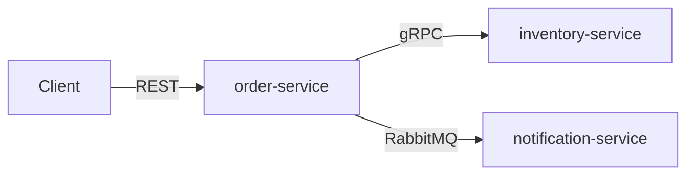

# Go Order System

A small order processing system built as three Go services — written to show how I
think about backend architecture, not to sell a product.

The code is deliberately modest in size. The reasoning behind it is the point, and it
lives in **[ARCHITECTURE.md](ARCHITECTURE.md)**.

---

## What it does

A client places an order. The order service reserves stock from inventory over gRPC,
saves the order, and publishes an event. The notification service picks that event up
and tells the customer.



| Service | Responsibility | Exposes |
| --- | --- | --- |
| **order** | Accepts and manages orders | REST API, RabbitMQ events |
| **inventory** | Tracks and reserves stock | gRPC API |
| **notification** | Sends notifications | consumes events |

That is the entire feature set, and it is small on purpose: enough surface for the
problems worth showing — partial failure, contracts between services, consistency
across a network — without the noise of a real product.

---

## Why this exists

Plenty of showcase projects demonstrate that the author can wire libraries together.
This one tries to demonstrate judgment: why three services rather than one, where a
contract belongs, what happens when the third call in a chain fails, and when a pattern
is not worth what it costs.

Every significant decision is written down with its alternatives, its trade-offs, and
the conditions under which I would decide differently.

**[Architecture.md](Architecture.md)** answers:

- Why three services — and what would tell me the boundary is wrong
- Why one repository instead of three
- Where the REST, gRPC, and RabbitMQ contracts live, and which service owns them
- How a service stays testable while depending on Postgres, gRPC, and RabbitMQ
- What happens when a step in the middle of the flow fails
- What CI enforces, so the document cannot quietly drift away from the code

If you only read one thing here, read that.

---

## Stack

| Purpose | Choice | Why |
| --- | --- | --- |
| Language | Go | — |
| Synchronous calls | gRPC + Protocol Buffers | typed contract, generated client |
| Schema tooling | [buf](https://buf.build) | generation, linting, breaking-change detection |
| Asynchronous messaging | RabbitMQ | routing and dead-letter support without operating a log |
| Storage | PostgreSQL via `pgx` | transactions, which the outbox depends on |
| HTTP | [Gin](https://gin-gonic.com/) on `net/http` | keeps routing, binding, and middleware concise while remaining confined to the inbound adapter |
| Logging | `log/slog` | structured logging in the standard library |
| Migrations | `golang-migrate` | plain SQL, versioned |
| Integration tests | `testcontainers-go` | real Postgres and RabbitMQ, started by the test |
| Linting | `golangci-lint` | — |
| Local environment | Docker Compose | — |
| CI | GitHub Actions | — |

Gin is a deliberate showcase choice, not an application-wide abstraction. Handlers
translate HTTP into application commands; no Gin type crosses the inbound adapter
boundary. Server timeouts and graceful shutdown still use `net/http` directly.

---

## Patterns and approaches

Each is argued for in [Architecture.md](Architecture.md); the short version:

**Boundaries**

- Service boundaries drawn around rules and failure modes, not around database tables
- Each service owns its public API in a separate, dependency-light Go module
- Go workspace with one module per service, so no service can reach into another's
  internals

**Inside a service**

- DDD models aggregates, value objects, business errors, and domain events
- Clean Architecture keeps dependencies pointing inward: adapters to application to
  domain
- Hexagonal architecture: the application owns ports and infrastructure satisfies them
- Inbound and outbound adapters are separated explicitly; HTTP and gRPC are transport
  adapters
- Domain packages import only the standard library and know nothing about transport or storage
- Applied where there are rules worth protecting — deliberately *not* applied to
  notification, which has none

**Across the network**

- Transactional outbox, so saving an order and publishing its event cannot disagree
- Idempotency keys on every call that changes state, so retrying is safe
- Expiring reservations, so a failure between two steps repairs itself
- Idempotent consumers, because every hop delivers at least once
- Dead-letter queues with three retries, and permanent failures parked immediately
  rather than retried pointlessly

---

## Tests

Every layer is tested, and the layers are separated so that the fast tests stay fast.

| Level | What it covers | Needs |
| --- | --- | --- |
| **Unit — domain** | Business rules in isolation: an order cannot be confirmed without a reservation; stock never goes below zero | nothing — no Docker, no network |
| **Unit — use cases** | Orchestration, against in-memory fakes of the ports | nothing |
| **Integration — adapters** | Repositories against real Postgres, publisher and consumer against real RabbitMQ, including retry and dead-letter behaviour | testcontainers |
| **Integration — contracts** | HTTP handlers conform to the order OpenAPI document, and the workspace compiles so every gRPC client matches its server contract | nothing |
| **End to end** | Placing an order all the way through to a notification | Docker Compose |

```bash
make test              # unit tests — fast, no infrastructure
make test-integration  # adapters, against containers
make check             # current local checks: Compose config, go vet, and unit tests
```

The end-to-end, lint, buf, and import-boundary targets will be added with the
corresponding implementation; the Makefile does not advertise placeholder checks that
silently pass.

Two things worth noticing:

- **Failure paths are tested, not just happy paths.** A timed-out reservation, a
  duplicate event, and a message that exhausts its retries all have tests. They are the
  cases the architecture exists for.
- **The architecture document is checked by CI.** Claims like "the domain depends on no
  infrastructure" are import checks that fail the build, not statements of intent.

---

## Repository layout

```
order-service/
  Dockerfile                         development and production image targets
  .air.toml                          development hot reload
  api/                               public contracts, in their own Go module
    go.mod                           gRPC and protobuf dependencies only
    openapi/order/v1.yaml            inbound REST contract
    proto/order/v1/events.proto      outbound OrderCreated contract
    gen/order/v1/                    committed generated Go code
    topology.go                      exchange and routing key names
  cmd/order/main.go                  composition root and entry point
  migrations/                        versioned order database migrations
  internal/order/
    domain/                          aggregates and business rules
    application/                     use cases and outbound ports
    adapter/
      in/
        httpgin/                     inbound REST adapter
        worker/                      inbound trigger for the outbox relay
      out/
        inventorygrpc/               outbound inventory adapter
        postgres/                    outbound persistence adapter
        rabbitmq/                    outbound event publisher
  internal/platform/                 config, observability, HTTP lifecycle
  go.mod

inventory-service/                   same dependency rules, shaped around inventory
notification-service/                thinner — no domain layering without domain rules

go.work                    ties the modules together for local development
buf.yaml                   proto workspace: lint and breaking-change rules
docker-compose.yml         local services and infrastructure
Makefile                   developer entry points
Architecture.md            the decisions, and why
```

---

## Running it locally

```bash
git clone <repo> && cd go-order-system-showcase
make help        # show every available command
make dev         # order service + PostgreSQL, foreground with hot reload
make up          # same stack, detached
make logs        # follow the order and database logs
make db-shell    # open psql in the order database
```

As the inventory and notification services are implemented, `make up` will grow to
start the complete system.

`go build ./...` works on a fresh clone with no code generation step — the generated
protobuf code is committed, for [reasons explained here](Architecture.md#trade-offs-accepted).

---

## Status

In progress. The architecture is settled and documented; the services are being built
against it.

- [ ] Contracts, buf setup, Go workspace
- [ ] inventory-service — gRPC server, reservations with expiry
- [ ] order-service — REST API, gRPC client, outbox
- [ ] notification-service — consumer, retries, dead-letter queue
- [ ] End-to-end flow and Docker Compose
- [ ] CI checks
